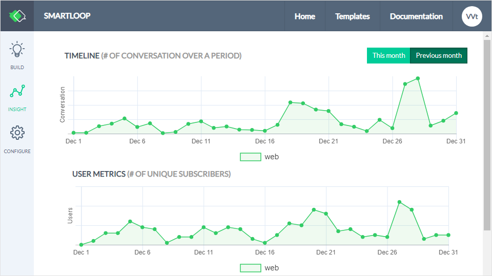
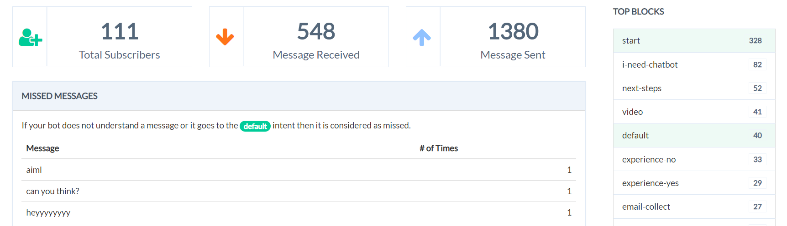
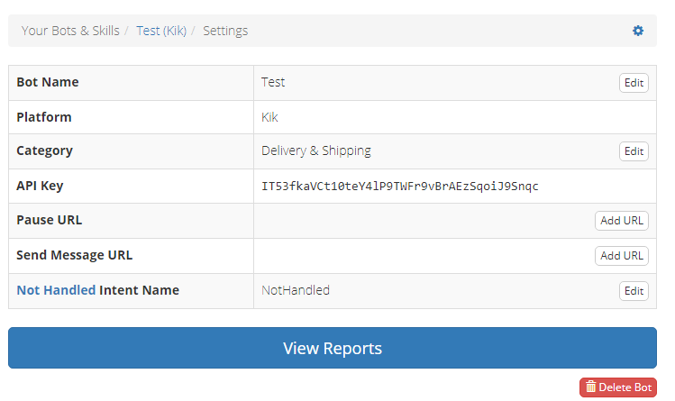

# Monitoring a Bot

The [Smartloop](https://smartloop.ai/?utm_source=smartloop&utm_medium=documenation) platform monitors your bot automatically and provides you with several essential metrics, which will allow you to improve it and train it. 

In addition, you can integrate a third party bot analytics tool. Here is how they compare:

| Platform | Web chat | Facebook | Viber | WeChat | Skype | Others |
| -------- |:--------:|:--------:|:--------:|:--------:|:--------:|:--------:|
| [Smartloop](#smartloop) | Y | Y | Y | Y | Y |  |
| [Botanalytics](#botanalytics) | Y | Y | Y | Y | Y | Y|
| [Dashbot](#dashbot) | Y | Y | Y | - | - | Y |

#### Using another analytics platform?

If you want to use an analytics platform that is not listed above, please [contact us](mailto:hello@smartloop.ai).

## Smartloop Insights

The metrics which the Smartloop platform provides you with can be found in the **Insight** section of each bot:

The **Insight** section will provide you with the following information, updated every hour after the bot is published to a live environment:

#### Period

**Smartloop Insights** are available for the current and previous calendar months only. If you need data that is older than 2 calendar months, consider using one of our integration partners, listed below. 

#### Timeline of Conversations

The timeline shows the total number of conversations over the selected period. This number is inclusive, meaning that it will include all conversations from the same user over the selected period. Hovering each data point will give you the exact number of conversations for that day. 

#### Timeline of Unique Users

This graph shows you the number of unique users who have used your bot for the selected period. Hovering each data point will give you the exact number of users for that day. 

#### Total Subscribers

This number shows the number of unique bot subscribers/users who have used your bot for the selected period. 

Please, note that these are not your bot’s active subscribers, but the ones who used the bot for the selected month. If you want to see your bot’s total number of unique subscribers/users, go to to the **Configure section** and locate your bot’s subscribers in the Pricing Plan.

#### Message Received

This number shows the total number of messages received by the bot for the selected period. 

#### Message Sent

This number shows the total number of messages sent by the bot for the selected period, and includes all broadcasts and sequences. 

#### Top Blocks

These are the top 10 blocks which your users have visited for the selected period.

#### Missed Messages

This is a list of the top 10 messages that the bot was not able to understand for the selected period. You can use this list to train your bot to reply better by adding these messages as [expressions](https://docs.recime.io/basic-concepts.html#expressions) to the respective blocks.

## Botanalytics

Follow these steps to integrate Botanalytics with your Smartloop chatbot:

1. Go to [https://botanalytics.co/](https://botanalytics.co/?utm_source=smartloop&utm_medium=documenation) and sign up with your credentials. 
2. Add your new bot to Botanalytics:(If you already have the bot created in Botanalytics, go to Settings → Bot and expand your bot. You will find the API key there.) 
   1. We’ll suggest to use the same bot name as the one in Smartloop   
   2. Make sure to select the same target platform (i.e. Viber of Facebook Messenger)   
   3. Fill out the category and other fields. After you save your settings, you'll see your bot token:
         
3. Copy the bot token. 
4. Go to [https://dashboard.smartloop.ai](https://dashboard.smartloop.ai) and log in. 
5. Select your bot 
6. Go to the **Configure tab** and locate the THIRD-PARTY ANALYTICS section.  
7. Select **Botanalytics**.  
8. Paste the API key (i.e. the token) in the field. 
9. Click the **+Connect** button and you are set! 

## Dashbot

Follow these steps to integrate Dashbot with your Smartloop chatbot:

1. Go to [https://reports.dashbot.io/](https://reports.dashbot.io/) and sign up with your credentials. 
2. Create a new bot to Dashbot: (If you already have the bot created in Dashbot, click on the gear icon (Settings). You will find the API key there)
   1. Make sure to select the same target platform (i.e. Viber of Facebook Messenger)   
   2. We’ll suggest to use the same bot name as the one in Smartloop.  
   3. Fill out the category. After you save your settings, you'll see your’s API key:
      
3. Copy the API key. 
4. Go to [https://dashboard.smartloop.ai](https://dashboard.smartloop.ai) and log in. 
5. Select your bot. 
6. Go to the **Configure tab** and locate the THIRD-PARTY ANALYTICS section.  
7. Select **Dashbot**.  
8. Paste the API key in the field. 
9. Click the **+Connect** button and you are set!
