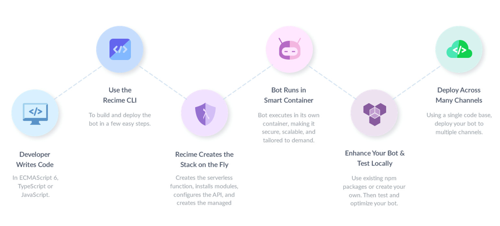

# Introduction

Recime (ˈresəˌmē) an end-to-end AI chatbot solution to automate customer support and content distribution. It gives you the tools to build omni-chaneel chatbots quickly and easily and eventually measure growth and user engagement to save cost and increase customer satisfaction.

## Supported Channels

Recime is committed to supporting the most channels on the market. Today, you can use Recime to build bots for:

| Channel||
| ---- | ---- |
| Facebook Messenger | |
| Web (HeadChat) | |
|WeChat||
|Viber||
|Slack||
|Telegram||
|SMS (Twilio) ||

The Recime Cloud gives you full advantage of the range of structured and rich message types these channels have to offer, all via one easy-to-use and consistent API. When new features are released by channels, Recime stays up to date and helps you take advantage of the new functionality with little or no changes to your existing code.

## We're Here to Help!

Need help? If you can’t find the answer you’re looking for in this documentation, get in touch with us by [email](mailto:hello@recime.io).

## Join the Slack Channel

You can find us on our [community slack channel](https://slackpass.io/recimecommunity) and on [twitter](https://twitter.com/GetRecime) for the latest news and we would love your feedback and ideas to improve the platform.

