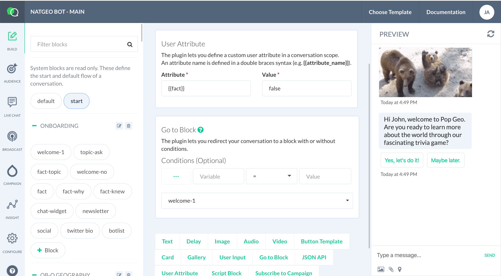

# Introduction

Learn everything to know about Smartloop platform.

**Smartloop** platform enables you to quickly and easily create AI-powered cross-channel conversational bot with a point and click interface. Measure and understand your users through conversational analytics, segment and re-engage based on user actions and variables in just a few easy steps.

The platform offers you full advantage of the range of structured and rich message types these channels have to offer, all via one easy-to-use and consistent interface.

Creating a bot (a.k.a. automated agent) is easy and free. Create an [account](https://dashboard.smartloop.ai) and head to the [Getting Started](/getting-started.md) section to publish your first conversational bot. 

## Support

Having trouble finding what you’re looking for? [Tell us](mailto:hello@smartloop.ai) so we can better help you!
