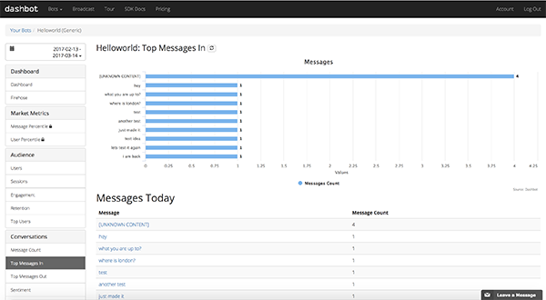

# Analytics

Bot analytics lets you understand metrics, sentiment, identify problems, and increase engagement for your bot.

## Configuring `dashbot.io` with Recime

In order to configure `dashbot.io` with `recime`, first install the `dashbot` module by typing the following command while in your bot folder:

```
npm install --save dashbot

```

Go to `dashbot.io` and  add a `facebook` bot  and copy the api key:


Configure the api key as config var by typing the following command while inside your bot folder:

```
recime-cli config set DASHBOT_API_KEY=PASTE_YOUR_APIKEY_HERE

```

Create `analytics.facebook.js` and paste the following code:

```javascript
import dashbot from 'dashbot';

export default class Analytics {
    constructor(){
        this.logger = dashbot(process.env.DASHBOT_API_KEY).facebook;
    }

    incoming(body){
        this.logger.logIncoming(body);
    }

    outgoing(reqData, body){
        this.logger.logOutgoing(reqData, body);
    }
}

```

Deploy your bot to start monitoring your `facebook` data:




`recime` supports platform specific hooks. Therefore, it possible to configure platform specific analytics and have them under separate modules. For example:

analytics.viber.js => viber
analytics.telegram.js. => telegram
analytics.js => generic / common


Since, it is possible to add platform specific analytics therefore you can mix & match different analytics providers that work with a specific channel the best for better insights.
