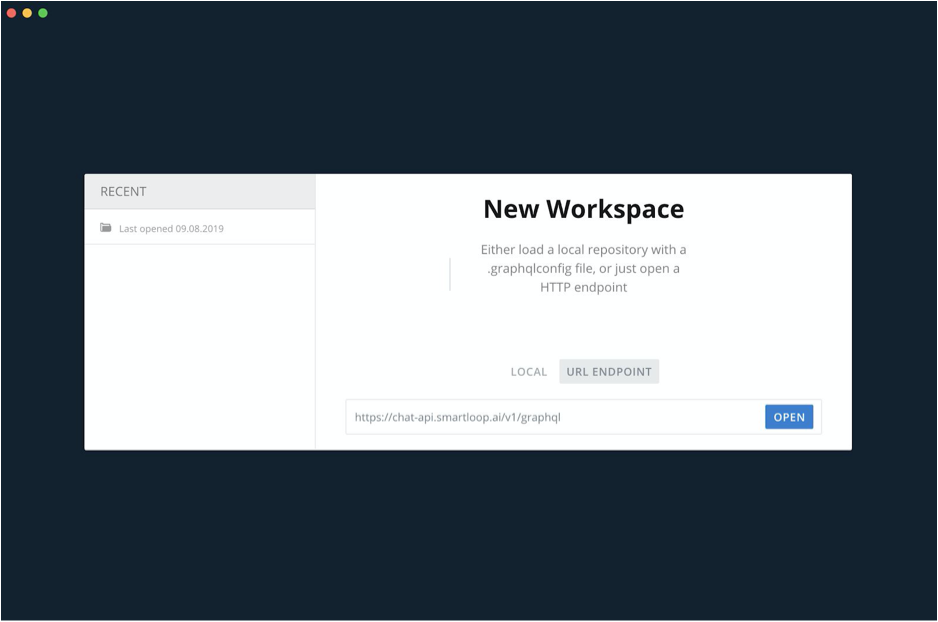
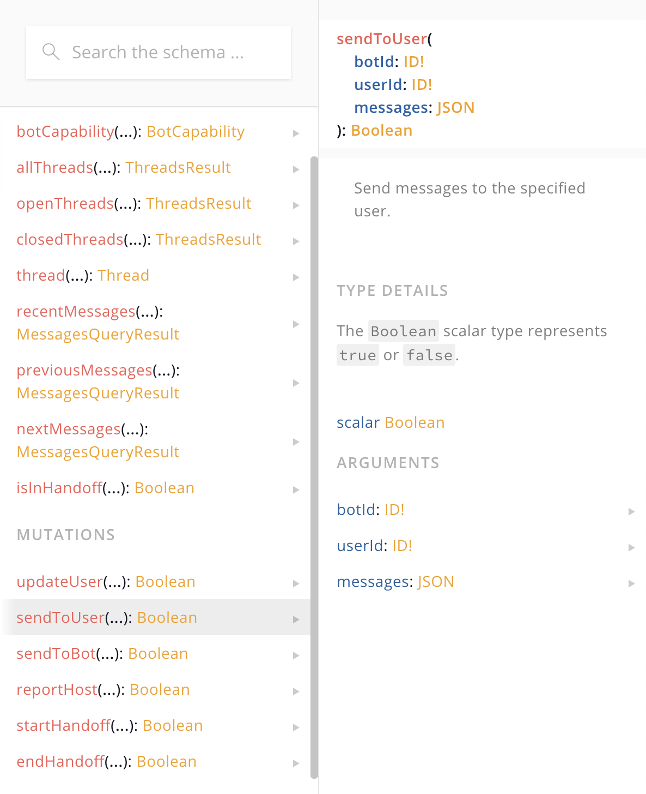
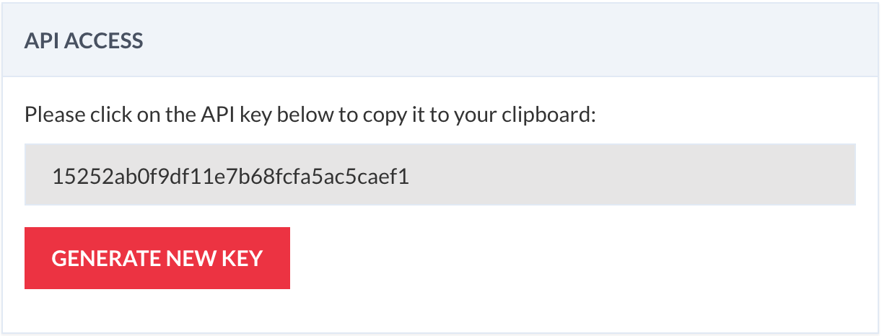
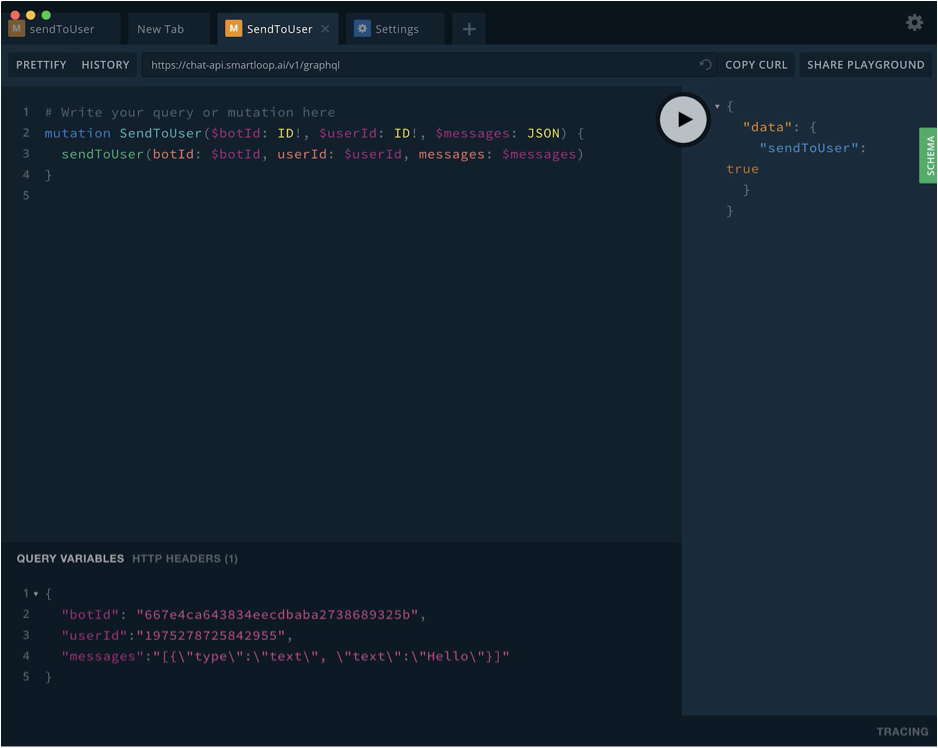
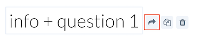
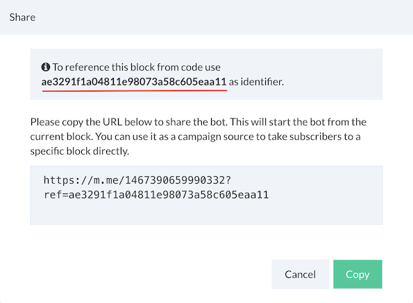

# API Access

Chat API is designed to extend conversation builder capabilities in a custom channel and enable bi-direction communication.

Download the GraphQL playground from the link below:

[https://github.com/prisma/graphql-playground](https://github.com/prisma/graphql-playground)

Once configured, in the new workspace dialog paste the following endpoint:

[https://chat-api.smartloop.ai/v1/graphql](https://chat-api.smartloop.ai/v1/graphql)

Click “Open”. 



GraphQL APIs are self-descriptive, the schema tab will give you an overview of the available operations (mutations) and queries for a given api endpoint.



Obtain your API key from configure (⚙) -> API Access  as shown below:



Paste it to the **HTTP headers** for `x-api-key`:

```json
{
  "x-api-key":"d10a7130f64c11a88bc375a5ba532e04"
}
```

 
We are now ready to make requests to the Chat API. Below, an example of how to send a message to the subscriber using ‘sendToUser’ method.

Here, you will add a mutation to the GraphQL API:

```
# Write your query or mutation here
mutation SendToUser($botId: ID!, $userId: ID!, $messages: JSON) {
  sendToUser(botId: $botId, userId: $userId, messages: $messages)
}
```

Next, you will define the variables that are required for the particular operation:
```json
{
  "botId": "667e4ca643834eeaddaba2738689325b",
  "userId":"1975278725842955",
  "messages":[
	{
		"type" : "text",
		"text": "Hello world"
	}
  ]
}
```


Click on the play button to execute it.



Please check out the documentation to understand the basics of user attributes and get an overview on how to obtain a user Id:

[https://docs.smartloop.ai/user-attributes.html](https://docs.smartloop.ai/user-attributes.html)

::: tip
Note that **messages** is an array and it can be used to send out the following types:

* Text
* Image
* Button Template
:::

Below is are examples of payload for each type:


::: tip Messages
`messages` is an array and JSON values are represented by ECMA-404
:::

**Text:**
```json
{
    "type" : "text",
    "text": "Hello world"
}
```

**Image:**

```json
{
	"type" : "image",
	"image": "https://smartloop.ai/assets/img/banner.jpg"
}
```
**Button Template:**

```json
{
	"type" : "button-template",
	"template":{
		"text": "Button Template",
		"buttons": [
			
				{
					"type": "url",
					"title": "Smartloop",
					"url": "https://smartloop.ai"
				},
				{
					"type": "postback",
					"title": "Start",
					"postback": "start"
				}
			]
	}
}
```

::: tip How to obtain a block identifer

In order to send postback to the bot, you will need the block identifer, an easy to way to get this is through the share dialog.

Click on the `share` icon next to a block name:



This will bring up the share dialog, copy the identifier to use it inside an UI element(e.g. button template):



**Note**: The bot must be connected to a channel in order to obtain the unique identifer.

:::