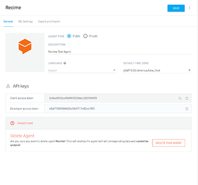

# Natural Language Understanding with API.AI on Recime

[api.ai](https://api.ai/) is a natural language understanding platform that makes it easy for developers \(and non-developers\) to design and integrate intelligent and sophisticated conversational user interfaces into mobile apps, web applications, devices, and bots.


In order to enable natural language processing using API.AI in Recime. Go to your `api.ai` console and copy the client access token:



For more information on how to obtain access token, please checkout the API.AI documentation here:

[https://docs.api.ai/docs/key-concepts](https://docs.api.ai/docs/key-concepts)


Go to your terminal and type following command (CLI 1.2.2+):

```
recime-cli plugins add apiai --apikey=API_AI_CLIENT_ACCESS_TOKEN

```

`API.AI` makes it really easy to define your entities and intents using their interactive console. As for example, we have defined the following intent for extracting city for a given user expression.


`apiai` is available as a bot level variable.

```
apiai.extract(text).then((data)=>{
     let result = data.result;
     // TODO://
 }, (err)=>{
     reject(err.message);
 });

```

Result will contain the actions and entities that you have setup in the console.
