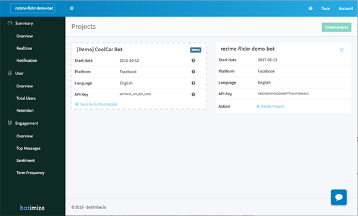
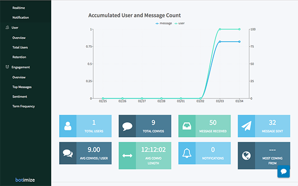

# Botimize Analytics

[botimize.io](http://botimize.io) lets you quickly monitor your bot intents and interactions. In order to get started, sign up with `botimize.io` and copy the API key from your project settings page.




Once you have the API key and you are inside your project folder, type the following command:

```
recime-cli plugins add botimize --apikey PASTE_YOUR_API_KEY_HERE

```

This will enable the project to track usage and interactions automatically.

Once deployed, go to your `Botimize` dashboard to check things like top messages, trends, etc. that can help you tailor and optimize the bot for the right audience.



