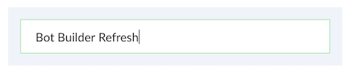
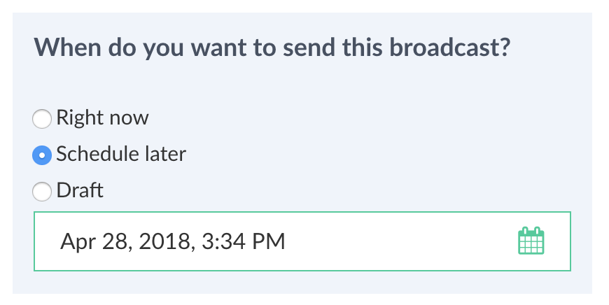
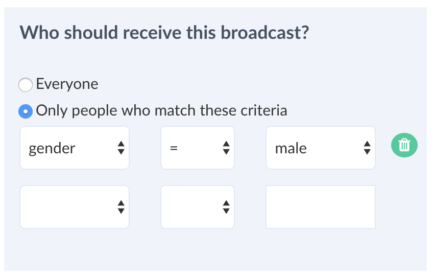

# Broadcasting (Push Notifications)

Broadcasting let you send messages to your customers and giving businesses drive more traffic to the product and engagement with customers in a personal way. Broadcasts can be used to notify users of the update of your product and give them a specific call to action to drive them to a flow in your bot.

You can schedule your broadcast at a later time or save it as a draft or send it immediately.

You can send text, images, cards in a broadcast. This varies based on the underlying platform. Facebook support the most features whereas, WeChat only supports text and article.

## New Broadcast

Once you click on "+ New Broadcast" it will take you to the broadcast builder. 

The first step is to give your broadcast a friendly name. This will help you organize the campaign and keep track of it.

Next, specify the time you want the broadcast to go out.

Create the user filter. 

You can send the message to everyone or based on the profile or a user-defined variable. User-defined variables are particularly useful if you want to send the broadcast to a group who haven't completed a flow or falls into given criteria based on the value you have set in the conversation flow.

Use the builder to create the messages you want to send. It can be text, rich media or can contain the call to action to a conversation flow.

Press "Send | Schedule | Save" based on what you want to do next.

## Clone a Broadcast

You can clone an already sent broadcast. Click on the icon from the "History" box to clone. You will then be able to modify and send it as mentioned above.

## Rate Limiting

Broadcast has a rate limit and counts towards the message count based on the number of subscribers it is sent to. On top of it, there is platform limitation, for example, WeChat will only allow you to send single broadcast per day.

