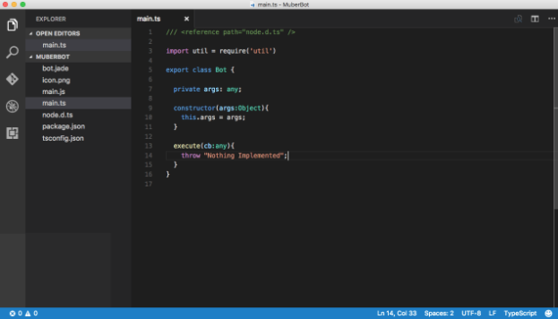

# Build your Bot

Now it is time to create the bot! Your bot will be simple “echo” bot: it will take a JSON input text parameter and return it back to you. Other tutorials will show you more sophisticated bots using Natural Language Processing and incorporating other platforms such as Facebook, but this one is just to get acquainted with the system and procedures.

We are going to edit the bot using `TypeScript`, which is automatically installed by `Recime Command Line Tool`

`TypeScript` is a first-class citizen in Recime. TypeScript is a typed superset of JavaScript that compiles to plain JavaScript. In addition to the great features you like about JavaScript, TypeScript offers benefits of special interest to developers coming from Strongly Typed, or Object Oriented backgrounds. 

However, it is possible to use other popular languages (e.g.`coffee-script`) which can be configured in `package.json`

To get started, open the newly created folder in your favorite code editor. The folder should be located under users/botname on your machine depending on how you configured Go and where you typed **recime-cli create**. 

Once in, navigate to main.ts file in the newly created bot folder which is the entry-point for your bot. The simplest form of `main.ts` looks like:



Our bot’s input JSON looks like this:

    {
        "text" : "Alan Turing"
    }

For the above JSON request, it will return “Hello Alan Turing”. 

The code to do this is simple. Replace the execute method with the following code in Main.ts which is in the project folder:

```
  execute(cb:any){
    let args = this.args;
    let text:string = args.text;

    if (text){
      if (text.indexOf("name") >= 0){
        cb({
            "text": "Error, please pass in ‘name’ parameter."
        });
      }
      else{
        cb({
          text : util.format("Hello %s", text)
        });
      }
    } else {
      throw "Missing \"text\" property."
    }
  }
}

```

Save all of your files and celebrate the creation of your first bot! Now it is time to deploy it to the recime service. When you deploy, recime will also compile the TypeScript document into JavaScript `main.js`.


