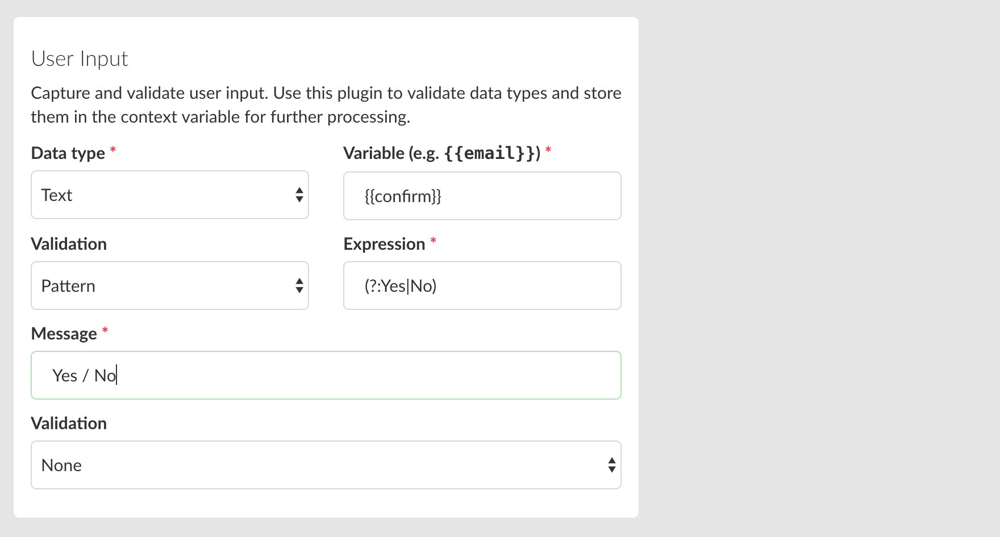
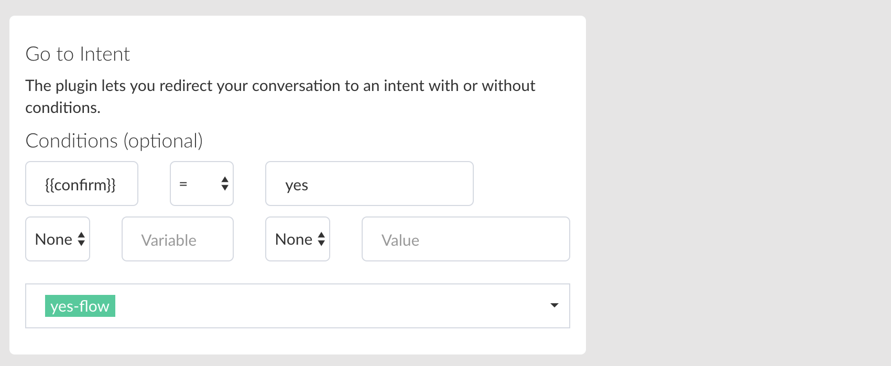
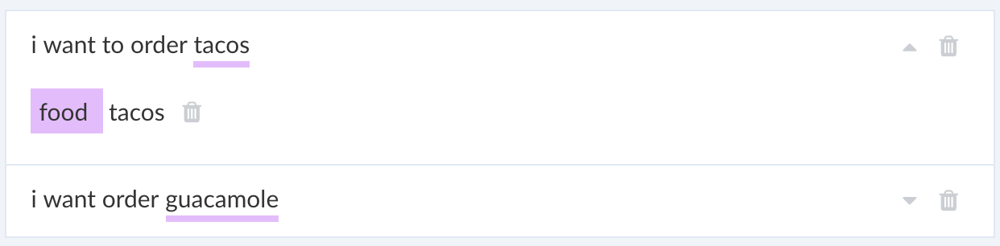

# Building a Bot

## Working with Blocks

A block contains user-defined messages that are triggered by a user input or an event.

User input is defined by expressions. Below is an example of expressions:

* Hi there!
* How's the weather in Paris?
* I want to travel from San Francisco to Madrid

An expression can be grouped into an intent and each intent has responses that will be sent out to the user.
Expressions are context driven which is different from keyword therefore, it does not have to be an exact match.

Here is an example of a context:

Here, I can say "What do you mean by a chatbot?" or "What is a chatbot?" and it will still return the correct block since the context is same or intead of "Paris", I can ask "How's weather in London?".

_Expressions make your bot smart!_

An expression can also have entities that can tell the natural language processor (AI) to extract a certain part of the sentence that will let you write custom logic (advanced). 


In short, an block is a box full of expressions and can have responses that are triggered by an user input or an event.


## Creating Responses

You can use plugins or cards to create responses. Responses can be visual or plugins to create flow or trigger other intents. A typical response can combine the following elements to build a rich user expereince for your bot:

*  Text
*  Image
*  Card 
*  Gallery
*  Generic Template (Facebook)
*  Article (WeChat)
*  Audio
*  Video
*  User Input
*  Go to Intent
*  User Variable
*  JSON API

Using plugins, implement custom logic, capture and validate input, make API requests and overall extend your bot for a richer experience


### User Input

The plugin allows you to capture and validate input from a user. It can be simple text or in the form of an action.

It supports the following data types:

* Text
* Number
* Date

It is possible to capture an user input and set it as a user variable to use throughout the scope of the session to take the user to various flows.

Here in the example, we are validating an email in the following way:


It is possible to capture input not only  for "text" input but also for actions  (e.q, quick replies) as shown below:


Here, in addition, we have used a regular expression pattern to ensure that it only accepts `blue`, `red` or `black`.


In order to capture quick replies as input, you will have to select "User Input" from the context drop-down and then set the reply as shown below:


Captured input is stored as a variable and you can print it inside a text element or use in it a different plugin as an input in the following way:


This variable is also available inside `script` block and in this scenario, you can retrieve the value of 'color' in the following way:

```javascript
exports.handler = (context, done) => {
    console.log(context.vars.get("color"));
    done();
};
```

### Go to Block

The plugin allows you to design conditional conversation flow. This helps you implement complex flow in your bot that is triggered by a user input or an event.

Here, in the example, the bot will take the user to a confirm transaction flow based on input. First, ask the user what they want to do next:


Next, use `user-input` plugin to capture the input using a pattern validation with a regular expression:



Finally, send the user to a `yes-flow` block based on if the user typed/pressed (`facebook` quick-reply) "yes" in the following way:




Otherwise, continue to no flow:


It is possible to use a second "go to" here in order to take the user to a dedicated __no flow__ block or send to a default block to restart the conversation.

## Working with Entities

Double tap a word in an expression to associate an entity with it.



It possible to link same entity for differnet words. Like in the above example, we have asscociated "food" for "tacos" and "guacamole" 

Entiteis defined in this way can be used as a user variable in a block, like based on selection, it is possible to send a user to a different block  using a 'go-to' based on an entity value.


An entity object can have various properties. A system entity or ***Star*** entity can have additional properties. For example, "datetime" can have properties to identify an weekend vs weekeday or time of the day when someone says:

> "Hows the weather tomorrow?"

Here "tomrorow" will return an addtional date object to futher understand the intent of the user. In general, an entity can have at least the following properties but not limited to:


| Property | Value |
| -- | -- |
| value | The word returned by the entity extractor for an expression. |
| confidence | The confidence level sent by the entity extractor |
| start | start index of the highlighted entity in an expression.|
| end | end index of the highlighted entity in an expression.


