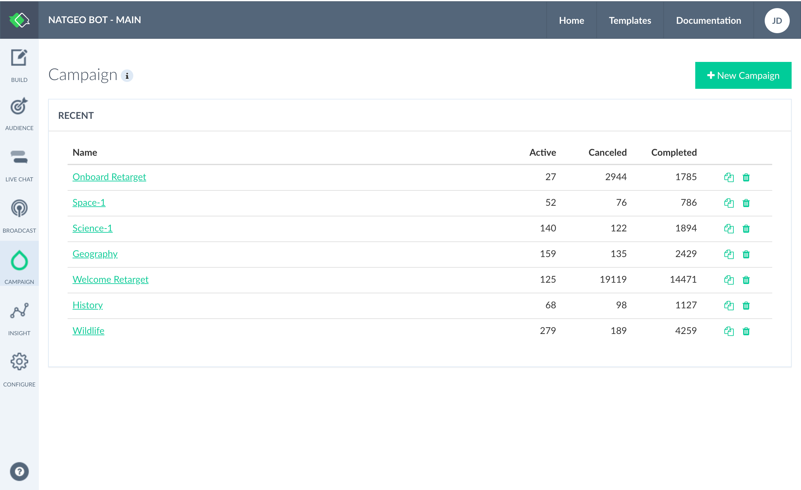
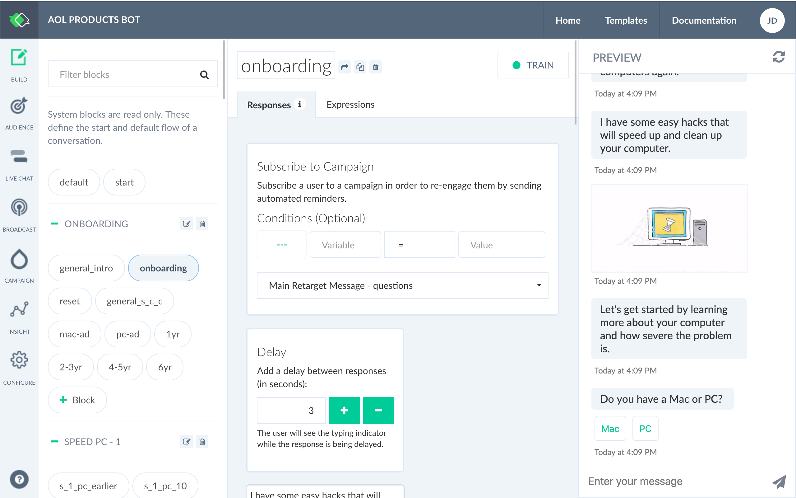

# Campaign

Create a campaign to engage your users at a future date. It enables you to qualify and nurture your subscribers based on user attributes and conditions.

Here, we will create an on-boarding campaign to re-target those who have not answered the qualifying question for a product or service.

Click on the "+ New Campaign". 

Here, I want to create a campaign where it will first send out push notification after an hour from the first interaction and second one in 24 hours, before we consider a lead is lost.

You can create multiple engagements from a simple point-of-entry as shown below. Here in the following example, I am sending out a product information to a potential customer based on her engagement portfolio with the messenger bot:

Now, as we have created a campaign, the next step is to have a user automatically subscribe to it. While in the conversation builder, click on the "Subscribe to Campaign" to add it to the workspace and then select the campaign that you would like to activate.

You have your user subscribed to a campaign, you would also need gracefully remove them from the list, when a given criteria is met or the campaign is over or no longer is valid. You can do so adding the "UnSubscribe from Campaign" and then selecting the campaign that you would like the user to unsubscribe from:

Campaign capabilities is great for **Drip Marketing** where a notification will be send out to your qualifying subscribers automatically on a schedule based on profile, interests and engagement patterns.