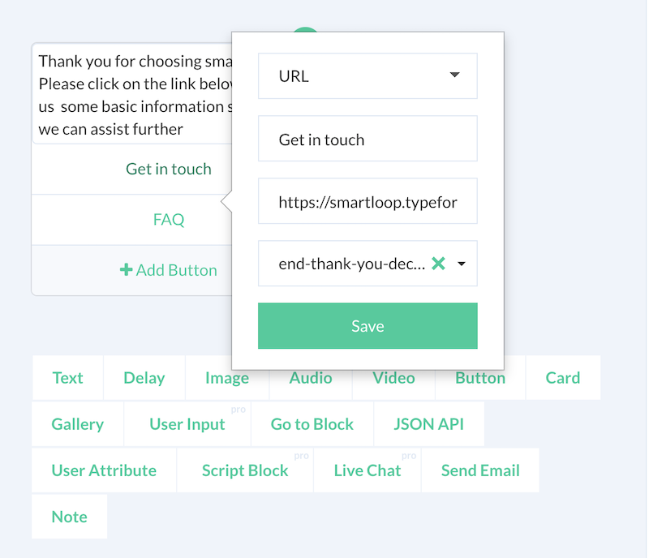

# Capturing Events

It is possible to capture events (e.g. clicking on a link) using a button template

Below is a sample using a button template:

Here, as the user clicks on the "Get in Touch" link, it will send the user to the "end-thank-you" block. We can do a few things:

* Send a friendly message after a link clicked for the next steps.
* Set a user attribute to track the conversation and which is used to send out a re-target message at a later date.

Click events supported in the following components:

**Web**
* Button Template
* Card 

Use this capability to track your conversation at every step and measure CTR for your chatbot.