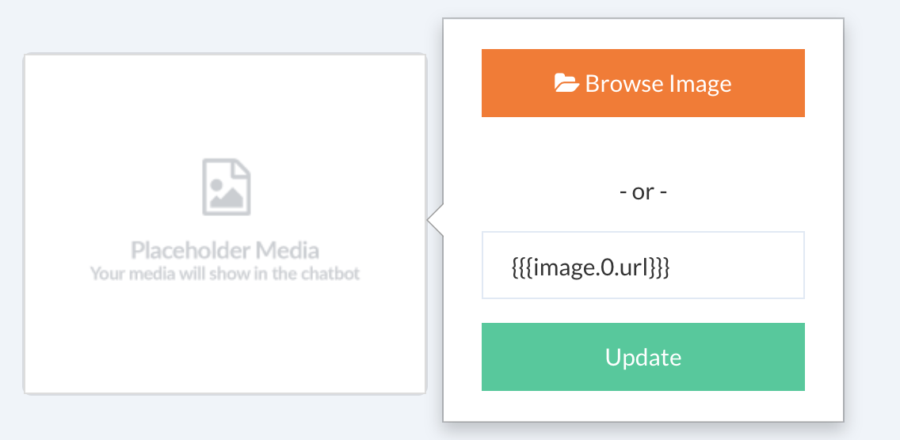

# Capture and Validate User Input

Use user input plugin to capture data in your bot. 

The following types are supported for an user input:

* Text
* Number
* Date
* Image
* File (Facebook)
* Location
* Phone

It is possible to capture user input and set it as a user attribute to create conditional flows.

The plugin can be used to validate a specific type, for example we are validating an email of a subscriber in the following way:


It is possible to capture input not only as a text but as a composite type (e.g. image), it possible to ask the user to upload an image and then validate and capture it in an attribute. We will have to select the type as an image and specify an attribute to capture the image:


Composite types can be accessed in the form of `args.type.property`, below is a list of composite types and their properties:

| Type | Property | - |
| -- | -- | -- |
| image | url | url of the image |
| file | url | url of the file | 
| location | lat, long | latitude and longitude of the location|

Here in this case, we can use the image property in an image element in the following way:




Note the syntax here with triple braces, In this case, the template engine won't encode the url which is already done by the underlying platform (e.g. Facebook, Viber). Otherwise, it will create an invalid url.

It is also possible to upload multiple files or images. Here in the example above, `image.0.url` is the first image at zero index. If you upload two images at the same time, you can access them like `image.0.url`, `image.1.url` and so on. In case, you want to iterate through all the images; you can do so by writing a custom a script or using the template iterator in the following way:

```html
{{#image}}
 {{{url}}}
{{/image}}
```

::: tip

A [mustache](http://mustache.github.io/) template is a string that contains any number of mustache tags. Smartloop adopts this most popular template format to process variables. Tags are indicated by the double mustaches that surround them. Here, in the above example triple parenthesis tells the compiler not to encode the url.

Follow the [Mustache Cheatsheet](https://gist.github.com/mehfuzh/b18d513b3dc1f2f62d4a10b9bbd33fe1) gist to get a better understanding.

::: 

It is also possible to capture user input in the form of a quick reply, from the quick reply content menu we select the following:

* Block 
* User Input

Select "User Input" to capture user input in the form of a quick reply:


Also, we can use pattern validation to define the scope of an input using a regular expression:


User input is stored as an attribute and you can print it inside a text element or use in it a different plugin as an input in the following way:

.

Attributes are accessed and defined using the double braces syntax. This is a standard template syntax for working with dynamic values.


In a more advanced scenario, you can reference the captured user input from a script block as shown below:

```javascript
exports.handler = (context, done) => {
 console.log(context.vars.get("color"));
 done();
};
```

The script block is for implementing custom workflows and designed towards developers.