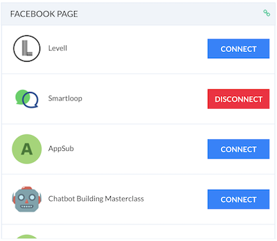
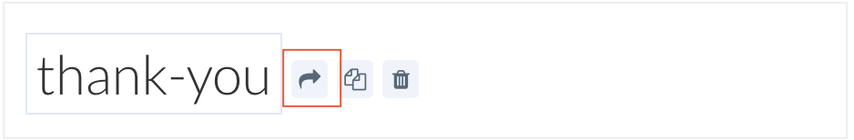
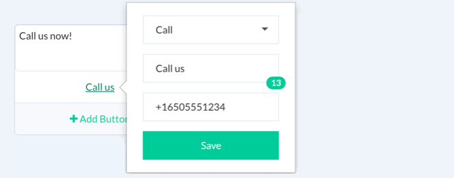
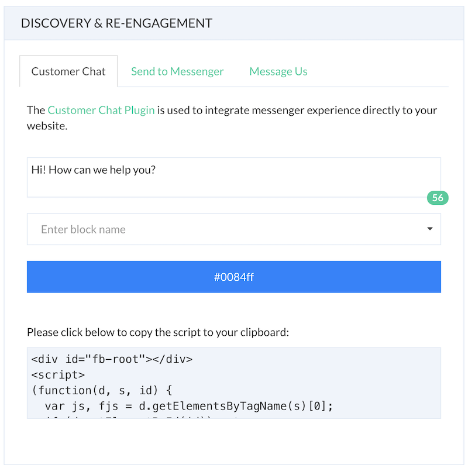
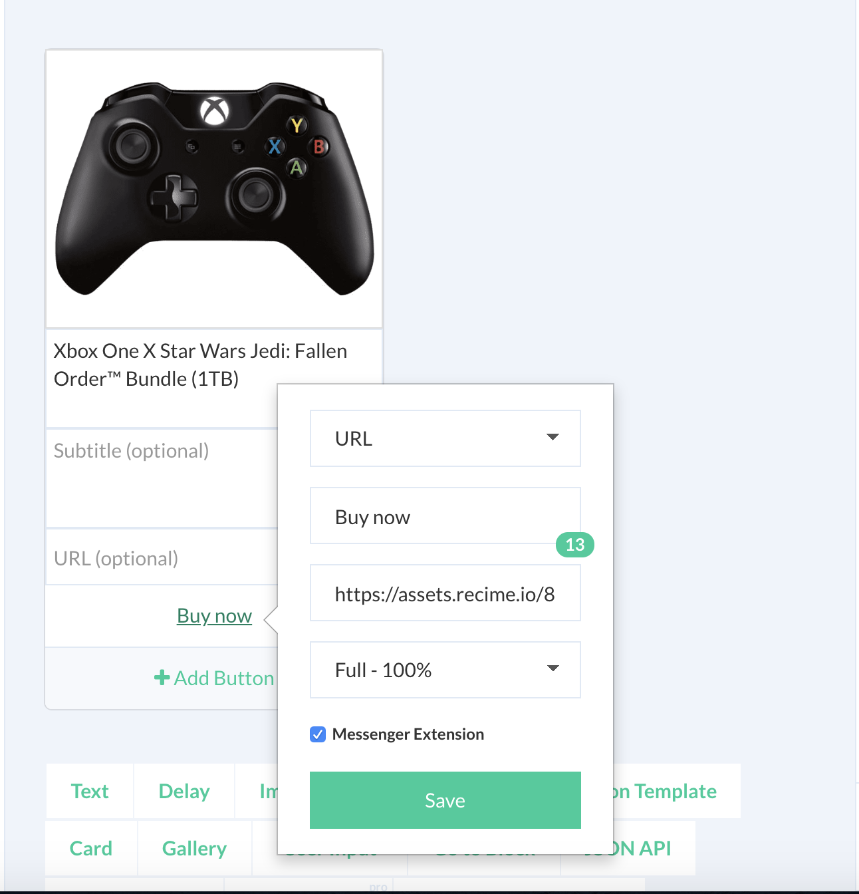
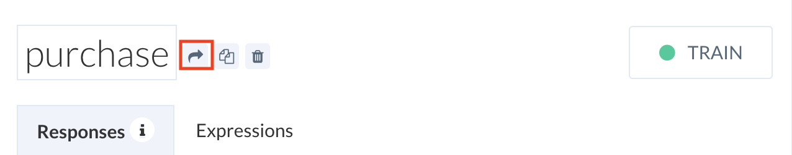
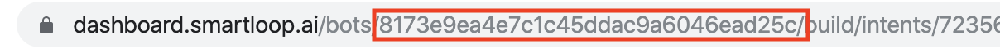
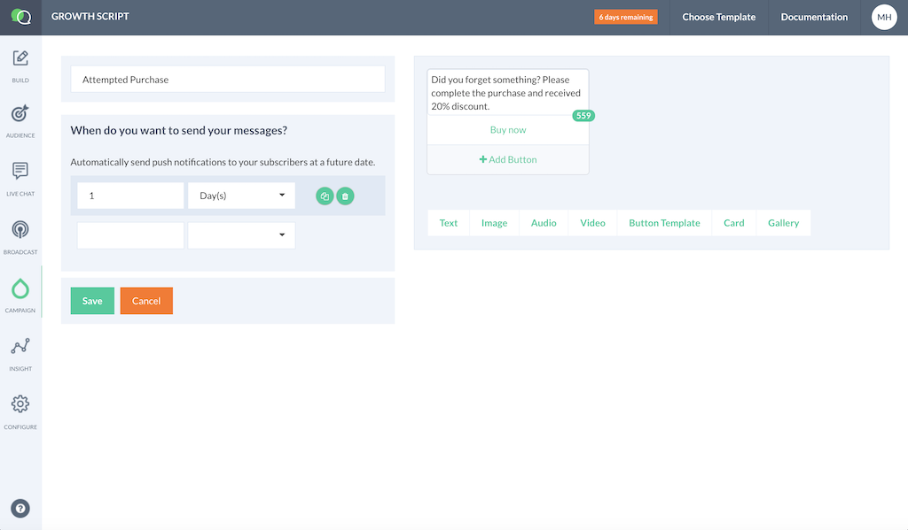
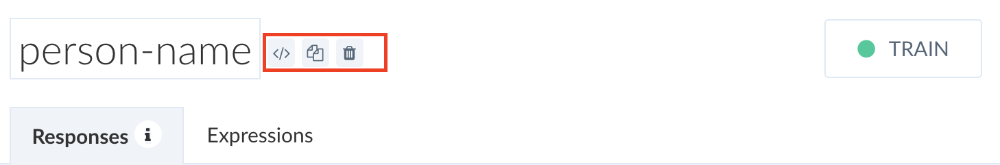
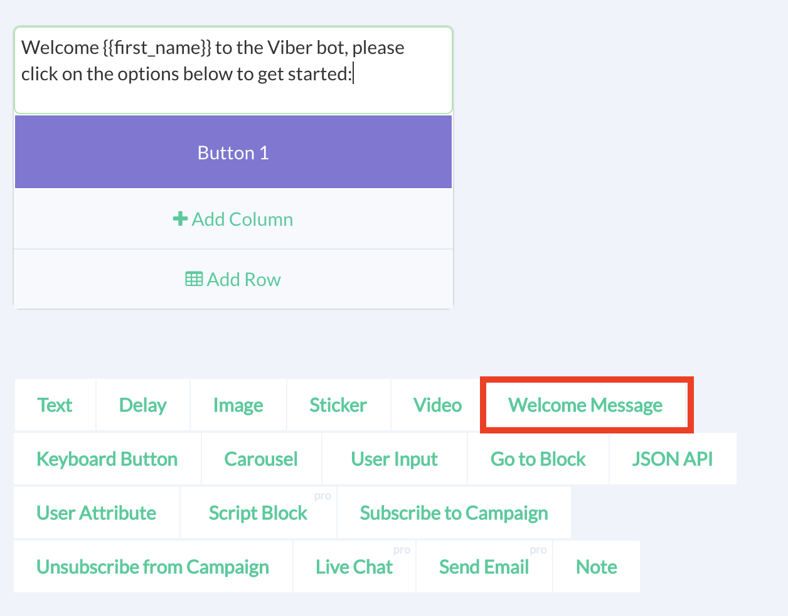

# Channels


## Facebook

### Connect your bot to a page

Connect your bot to a Facebook page using the Connect / Disconnect capability. If you are not already logged in using Facebook, it will take you through a wizard to connect Smartloop app to your page.



### Greeting Text

Greeting text is shown on the welcome screen. You can update the greeting and include {{user_first_name}}, {{user_last_name}} and {{user_full_name}} to make it more personalized.


### Persistent Menu

The persistent menu allows you to have an always-on user interface element inside Messenger conversations. This is an easy way to help people discover and access the core functionality of your Messenger bot at any point in the conversation.

You can link a block to the persistent menu. Click on "+ Menu Item" button to link blocks as shown below:


### Ref Links

Ref links can be used to send your subscribers to a specific block.  The format of a ref link is:

```
https://m.me/<page_id>?ref=<BLOCK_ID>
```

This can be used to create target flows based on ads preference and implmenting click to messenger capabilities.

You can generate `ref` for a block very easily by clicking on the block action `(share)` link as shown below:




### Call Button
The call button is used to initiate phone call from you messenger bot. In order to use call button, drop a `Button Template` or `Generic Template` in your block as showng below:



Select "Call" as your option and enter your phone number starting with `+1` followed by country code, area code and number.


### Customer Chat Plugin

Facebook customer chat plugin allows you to integrate messenger experience into your website. 

Configure your customer chat plugin from `configure -> Customer Chat` as shown below:




Copy and paste the script to your website before the `<body/>` tag.


### Actions

Suppose that you want to increase your abandon cart revenue. You want to create a campaign that will send a reminder to the user when someone didn't complete the purchase. 

Let's create a block called `purchase` and add the following button:



Create another block to receive the notification (e.g. `attempted-purchase`), click on the share link and copy the block ID as shown below:




Copy and paste the following script before the `<body/>` tag of your webview:

```javascript
<script src="https://scripts.smartloop.ai/v1/fb.actions.js"></script>
<script>
 window.extAsyncInit = function () {
 Smartloop.init('ACCESS_TOKEN');
 Smartloop.executeBlock('BOT_ID', 'BLOCK_ID');
 };
 (function (d, s, id) {
 var js, fjs = d.getElementsByTagName(s)[0];
 if (d.getElementById(id))
 return;
 js = d.createElement(s);
 js.id = id;
 js.src = "//connect.facebook.com/en_US/messenger.Extensions.js";
 fjs.parentNode.insertBefore(js, fjs);
 }(document, 'script', 'Messenger'));
</script>

```
Copy & paste the `ACCESS_TOKEN` from `configure-> api access`.


Copy & paste the `BOT_ID` from the URL as shown below:



Finally, subscribe the user to a campaign to send out a reminder.



Repeat the process by sending the user to a second attempt flow or mark the subscriber as won/lost.

This process makes it super simple to implement messenger marketing flows in your bot, increase abandon cart revenue, or re-target your subscribers that make the most sense for your use case.


## Website

Website bot gives the user a similar experience to that of a live chat. However, the conversation happens with an automated agent instead of a human. It increases efficiency and improves the quality of service.

### Configure and Install

To install the webchat module, please follow the simple steps below:

Click on the configure icon in your dashboard: 


To ensure that it is consistent with your brand, customize the look and feel of the module:


Next, follow the instructions to copy and paste the webchat module to your site:


### Sending User Attributes

User attributes allows you to track details about your subscribers. You use this data to segment them and send targeted messges to them.

Below is an example, showing how to track basic user profile, as well as custom attributes that could be valuable to qualify a lead or provide better support:

```javascript
<script>
    window.addEventListener('load', function () {
        const userId = webchat.getUserId();

        webchat.setUser({
            first_name: 'John',
            last_name: 'Doe',
            country : 'US',
            email: 'john@smartloop.ai',
            custom: {
                external_ip: "172.16.0.1"
            }
        });
    });
</script>
```

In additon to segmenting users, you can capture custom user attributes in the following way from a script block:

```javascript
import Ext from 'bot-extension';
const __ = Ext.default;

exports.handler = (context, done) => {
    const externalIP = context.vars.get("external_ip");
    
    console.log(externalIP);
    
    done();
};
```

Use the `request` module to save it to CRM or create addtional attributes based on it for a more personalized conversational experience.

### Sending Events to the Bot

Send an event notification to the bot to trigger a flow. 

The following example provides an example of how to set it up after the bot is set up. 

First, create the HTML button object:


```html 
<button id="request-a-demo">Request a Demo</button>
```

Copy and paste the following script before the `<body/>` tag:

```javascript
<script>
 (function(d) {
 d.addEventListener('DOMContentLoaded', function() {
 d.getElementById('request-a-demo').addEventListener('click', function() {
 webchat.open('block-id');
 });
 });
 })(document);
</script>
```

Here, it will open the website bot and take the user to the flow for the given block when the user clicks on **Request a Demo** button.

To configure the script with a block id, Inside the builder, click on the `</>` icon to get started:



### Properties

Below is a table with the definition of properties to configure your widget: 

| Configuration | Value|
| -- | -- |
| Theme Color | Theme of the bot. It includes icon, text and bar color |
| Secondary Color | Color of the text bubble. |
| Greetings text | Shown the first time the page loads.
| Greetings delay| Delay in seconds before showing the greetings message. Default = 5 seconds
| Launcher Icon | Start button icon |
| Silent Mode | On/Off. Default = off |


#### Additional Properties

You can further customize the widget by configuring the following properties:

| Name | Value| Default |
| -- | -- | -- |
| position | Position the widget to `left` or `right` of the screen | `right`|
| height | Height of the widet (e.g.80%)  | Widget default |
| attachment | Toggle attachment support `true` or `false`  | `true` |

Example:

```javascript
<script>
  (function(d) {
    window['recime-bot'] = {"id":"##","title":"Smartloop","apiKey":"##","language":"en","primaryColor":"#008eff","secondaryColor":"#eff4fa","avatar":"https://icons.recime.io/13d7bc056350b4f3d56dca1c753ce1e7.png","greetingText":"👋 How can we help you?","greetingDelay":2,"playSound":true, "position": "left", "height": "80%", "attachment": false};
    var s = d.createElement('script');
    s.setAttribute('id', 'recime-chatbot-script');
    s.setAttribute('src', 'https://webchat.smartloop.ai/shim.js');
    s.setAttribute('async', 'async');
    d.getElementsByTagName('body')[0].appendChild(s);
  })(document);
</script>

```


## Viber

### Welcome Message

:::tip
 Create two different blocks for `conversation_started` and `subscribed` events and apply the design principal, as mentioned here. Take advantage of viber events and map them to a block.
:::


When someone messages your bot for the first time or downloads a sticker pack, viber sends a `conversation_started` event. YYou can only send one message in "conversation_started" block. This is generally a welcome message, greetings or consent for your users. If users are taken to bot after downloading sticker packs then they will immediately be subscribed and taken to the "start" block instead.

Please, consider this design flow while designing new bots. If there is no "conversation_started", it will go to the "default" block.

Use "Welcome Message" plugin that combines the keyboard and text block for first time users as shown below:




### Naming Conventions
Make sure your Viber bot name is not too long. Make it short and precise. Viber also has a limitation of 28 characters for a sender name.
