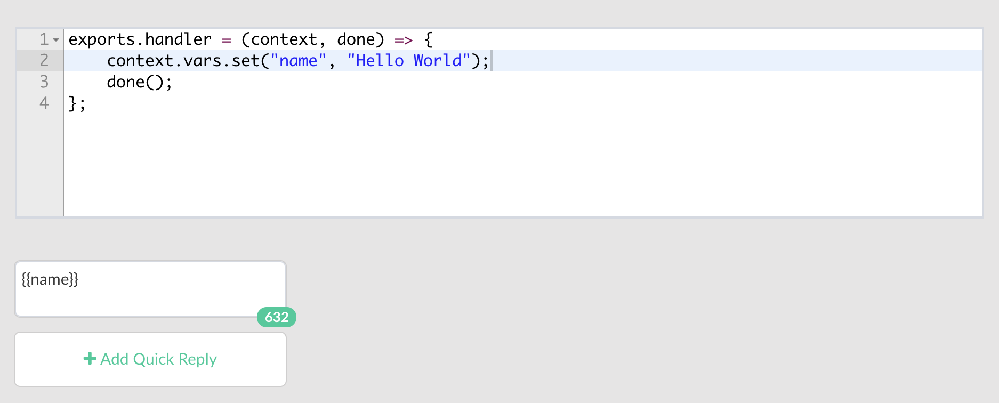

# Cloud Code

The Cloud Code runtime enables you to quickly build server-side logic from the `Coversation Builder`. Click on `code` button in the toolbar as shown below to insert code blocks in your conversation flow.


Here you can set variables which you can use from UI elements in the current context. 



`context` parameter have the following properties:

| Property Name | Description |
| -- |
| `args` | [User arguments](message-object.md)
| `nlp` | Extracted intents and entites.
| `vars` | User-defined variables that can be used within the context.


It also possible to use [extension module](https://github.com/Recime/recime-bot-extension) directly and return response from within a code block:

```javascript
import Ext from "recime-bot-extension";
const __ = Ext.default;

exports.handler = (context, done) => {
    done(__.text("Hello world"));
};
```

Cloud Code can be useful in the following scnearios:

* Retrieving data from your existing API that you want inject in the conversation flow.
* Construct dynamic response based on user input and extracted entities.


The following libraries are available in the **Cloud Code** execution enviorment:

* [node core](https://nodejs.org/api/modules.html#modules_core_modules)
* [request](https://github.com/request/request)
* [recime-bot-extension](https://github.com/Recime/recime-bot-extension)
* [recime-keyvalue-store](https://github.com/Recime/recime-keyvalue-store)
* console.log - To output directly into the bot. Used for debugging.
