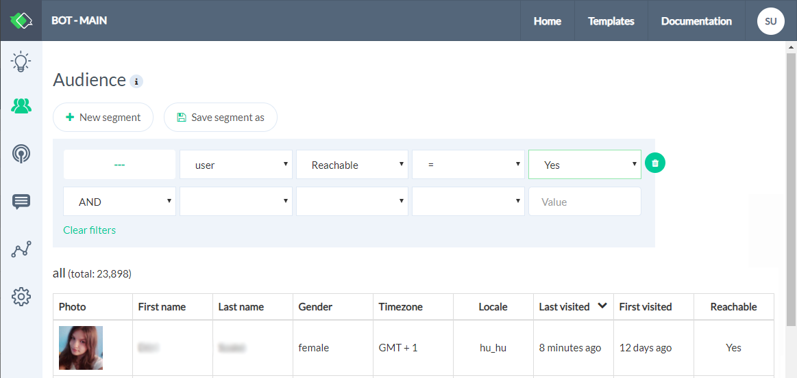

# Collecting User Data

::: warning Website Bot Only
It is only possible to override user profile data for a website bot. 
:::


To qualify a lead, it is essential that we collect user information that will help us re-engage at a later time. There are built-in user attributes that can be set automatically from input to achieve just that.

For example, we want to collect a user's *name* before we connect them with an agent. We can automate the process by adding a user input plugin and storing the result in a built-in attribute in the following way:


This is then available in the audience section, which can be used to create a segment and re-target at a later time.




Below is a list of built-in user attributes that you can use to collect user information:

* first_name
* last_name
* profile_pic
* country
* phone
* email

In the above example, we have used `name` which uses an expression based convention and tries to resolve the `first_name` and `last_name` automatically.

It also possible to set user attributes using a `script block` in the following way:

```javascript
//script block
exports.handler = (context, done) => {
    context.setUser({
        first_name: 'john',
        last_name: 'doe'
    })
    done();
};

```

Collecting user information in this way is useful for unauthenticated flow and lets you qualify leads better.

