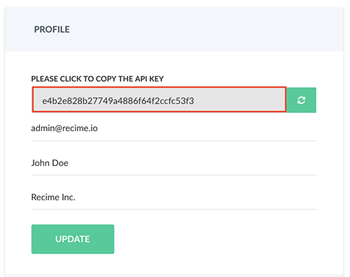

# Command Line Interface

`Recime Command Line Interface` requires [node](https://nodejs.org/en/) (version >=6.9.1) and uses `npm` as package manager.


## Installation

To Install the Command Line Interface, type the following command:

```shell
npm install -g recime
```

Once the CLI is installed correctly, type the following to verify:

```shell
rbp --version
```

## Setup

Go to [console.recime.io/my-account](https://console.recime.io/my-account) and copy the API key as shown:




Type the following command from your terminal:

```shell
rbp login
```

This will prompt for the token you have copied earlier. Paste and hit "enter". 

## Create a Bot

Create a folder by typing the following command:

```bash
mkdir bot-folder
```

Change the current directory to the newly created folder:

```bash
cd bot-folder
```

Create the bot by typing the following command:

```bash
rbp create
```

This will take you through a wizard and the create the bot in your [dashboard](https://console.recime.io).


## Debug


In order to debug your bot, type the following command:

```shell
rbp serve
```

The will prepare the bot and star the local server under `http://localhost:4000`.


For any changes you make in the source, it will automatically restart the process and sync the browser.

## Configure Platform Locally

It is possible to connect to a supported channel to debug the bot locally. In order to configure a channel, please type the following command:

```bash
rbp config facebook|viber|telegram
```
It will ask you the credentials for your platform and configure it for local debugging.

Debug the bot by typing the following:

```bash
rbp run 
```

Start chatting with your bot (e.g. Facebook) and you will see the logs in the console. 

_Warning: You will have to re-connect your bot using the publish tab once you connect it locally._

## Updating the Bot Icon

Add `icon.png` to your current directory and type following command to push it live:

```bash
rbp publish
```

The recommended icon size for a bot is 80x80.


## Roadmap
Publish custom modules using the Command Line Interface.