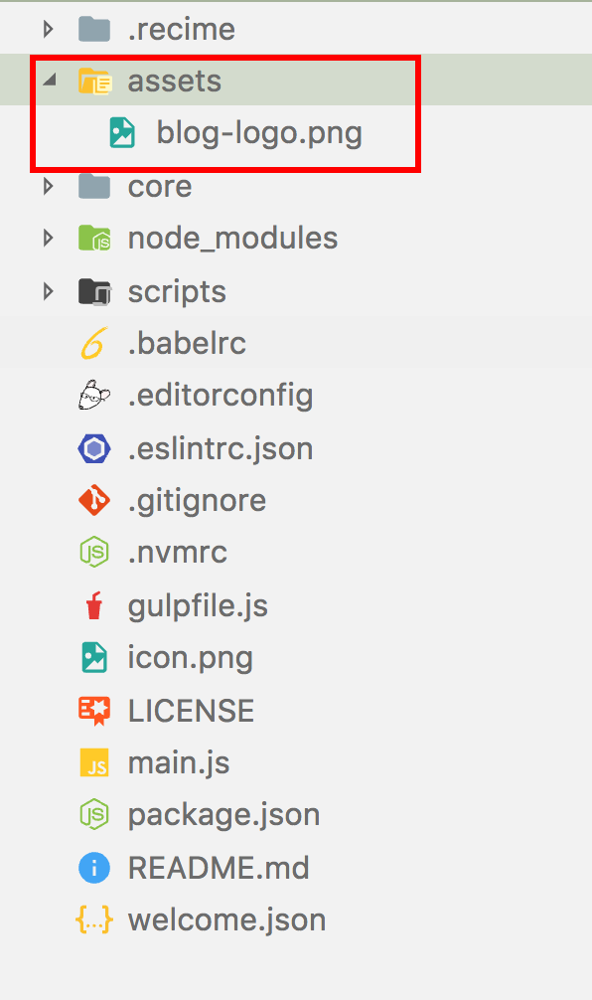

# Command Line Interface

`Recime Command Line Interface` requires [node](https://nodejs.org/en/) (version >=6.9.1) and uses `npm` as package manager.


## Installation

To Install the Command Line Interface, type the following command:

```shell
npm install -g recime
```

Once the CLI is installed correctly, type the following to verify:

```shell
rbp --version
```

## Setting it Up

Go to [console.recime.io/my-account](https://console.recime.io/my-account) and copy the API key as shown:


Type the following command from your terminal:

```shell
rbp login
```

This will prompt for the token you have copied earlier. Paste and hit "enter". 

## Build

From the terminal app, type the following command to create your bot project:


```bash
rbp create awesome-bot 

```

This will walk you through a command line wizard and create the bot under `awesome-bot` folder.

Navigate to `main.js` and you should see the following:

```javascript
import Ext from 'recime-bot-extension';
import responder from "recime-message-responder";

const __ = Ext.default;

exports.handler = (args, done)=>{
    done(responder.respond(args));
};
```

This will also create a version in [console.recime.io](https://console.recime.io) with basic intents to help build the conversation flow.

## Debugging


In order to debug your bot, type the following command:

```shell
rbp serve
```

The will prepare the bot and star the local server under `http://localhost:4000`.


For any changes you make in the source, it will automatically restart the process and sync the browser.


## Deploy

In order to push changes to live, you will need to deploy the bot by typing the following command:

```shell
rbp deploy
```
This will configure and deploy the bot with your custom logic and prepare it for pushing to various channels.


## Miscellaneous

### Static Content

In order to serve static content, add an `assets` folder in your project directory.



Use the `url` extension method in the following way to set it in your response:

```javascript
import Ext from 'recime-bot-extension';
import responder from "recime-message-responder";

const __ = Ext.default;

exports.handler = (args, done)=>{
    switch (this.args.event.name){
        case "start":
            done([
                __.text("Hey! There!."),
                __.image(url("assets/blog-logo.png"))
        ]);
        break;
        default:{
            done(__.text("Sorry, I didn't understand."));
        }
    }
};
```

### Using Local Storage

Install the `recime-keyvalue-store` npm module by typing the following command from your project folder:

```bash
npm install --save recime-keyvalue-store
```

Import the module by copy and pasting the folloiwng line in your source file:

```javascript
import db from "recime-keyvalue-store";
```

`key-value` is for fast read-write. Therefore, use it as a cache store for your bot.

```javascript
db.set("userId", {
    id : 1
}).then((_)=>{
    // TODO://
});

```

Similarly, use `db.get` to retrieve the value:

```javascript
db.get("userId").then((result)=>{
    console.log(result.id);
});
```

Key-value data is available throughout lifetime of your bot once deployed and supports the following javascript data types:

* Number
* String
* Object


Every bot gets its own managed and secure store. Number of unique keys are subject to plan, please checkout pricing page for more details.


We welcome your contribution and you can fork the source from [here](https://github.com/Recime/recime-keyvalue-store).
