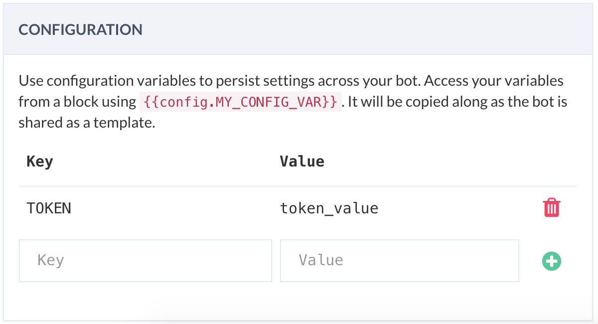

# Config Variables 

You can use config vars to persist settings across the bot. It is a good practice to consolidate your configuration (e.g., API key) in one place for maintainability. 



Configuration variables added in the settings-> configuration, as shown above, can be accessed using **double braces** from plugins (e.g., JSON API) in the following way:

```
{{config.API_KEY}}
```

Similarly, you can access them from code,  in the following way:

```javascript
exports.handler = (context, done) => {
 
    const token = context.config.API_TOKEN;
    
    // TODO:

    done();
};
```

## Policies
 * Config var keys should use only alphanumeric characters and the underscore character (_).

 * Config var keys should not begin with a double underscore (__).

