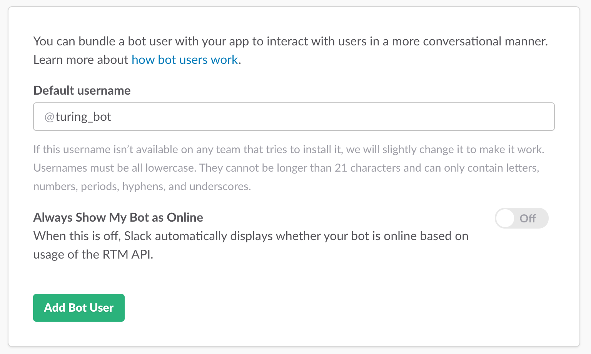
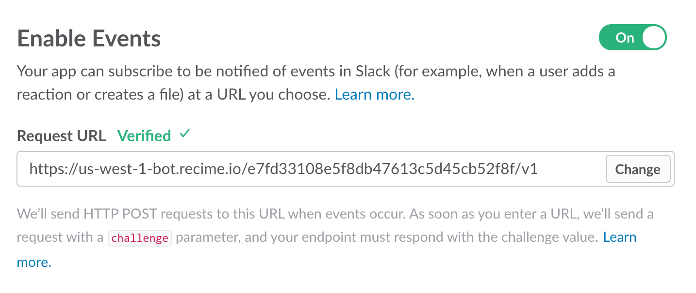
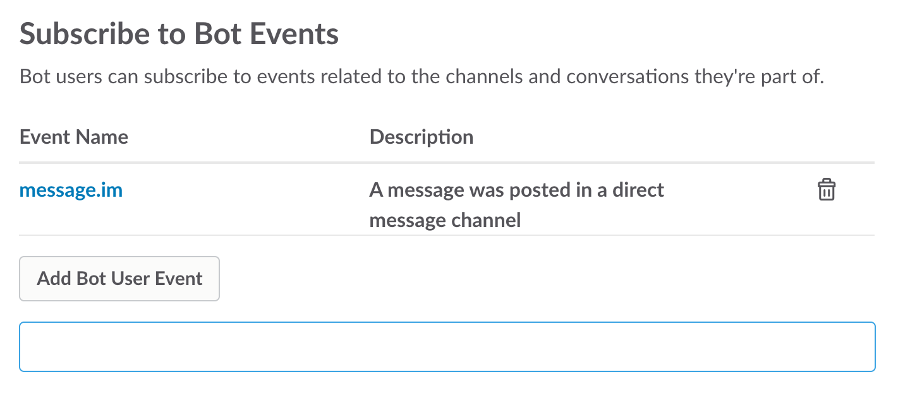
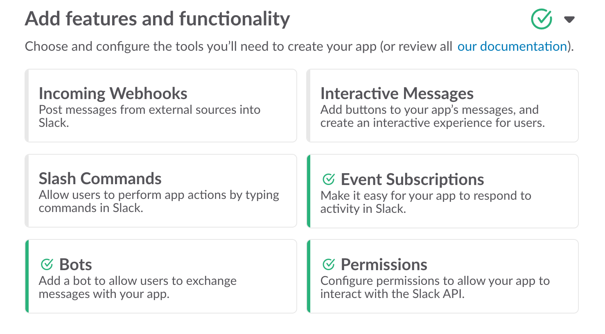

# Configure Slack Bot

Once deployed, the first step is to create a bot user. Go to "Add Features" section and click on "Bots" to add a new bot user.

Click "Add Bot".

Next, go to "Basic Information" and click on "Events Subscription" under "Add features and functionality". Toggle the "Enable Events" switch and then paste the bot endpoint in the `Request URL` textbox in the following way:

Next, subscribe to the events relevant to your bot. In this case, I've subscribed to `message.im` event that will send a callback to the bot for direct messages.

At this point, we have successfully configured the slack bot. Next step is to activate distribution for the bot to be shared with teams or submit your app to the [Slack App Directory](https://slack.com/apps).

