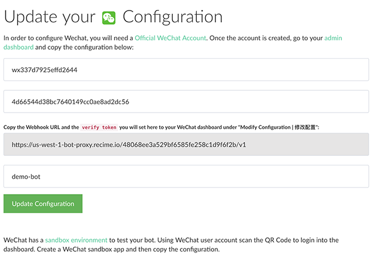

# Configuring WeChat

WeChat is the #1 messaging service in China. It is used by over 700 million users and it is the most important channel in the Chinese market. In order to configure WeChat, you will need an [official account](http://open.wechat.com/cgi-bin/newreadtemplate?t=overseas_open/section_detail&show=office). You can also get a [Sandbox](https://mp.weixin.qq.com/debug/cgi-bin/sandbox?t=sandbox/login) to test your bot.

Once your WeChat account is verified, do the following to connect to your bot:

* Go to [WeChat dashboard](https://mp.weixin.qq.com/) and under "Basic Configuration | 基本配置", copy the IP `52.79.59.62` to the whitelist section.
* Go to "console->bot->publish", paste the App ID and App Secret from WeChat dashboard and create a token that you will use to verify the integration.

* Press "Update Configuration".

* In the WeChat dashboard, click on "Modify Configuration | 修改配置" and under "Basic Configugration", paste the Webhook URL from publish page.

* Save the configuration and enable the integration.

