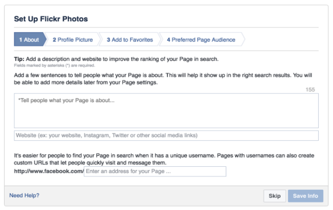

# Create Facebook Page

 In order to run your Recime bot on `Facbook Messenger Platform` you need a `Facebook Page` and a developers App ID. The first step is to [create the facebook page](https://www.facebook.com/pages/create/) for your bot. Log in to [www.facebook.com](https://www.facebook.com) and select “add page” on the top right menu. (This is a required step for all facebook messenger apps).

Choose a category (i.e. Entertainment) and fill in the requirements, use a unique name and profile picture so that it is easily discoverable.

