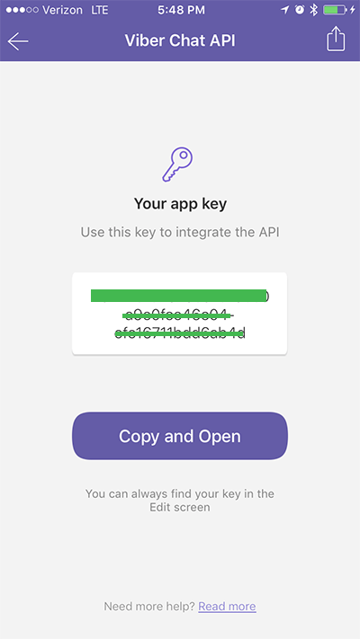

# Create Public Account

In order to create a `viber` bot, you will need to create a [public account](https://www.viber.com/public-accounts?ref=recime). The public account needs to be approved and once you setup the account, you will get an auth token which you will need to configure the bot.

