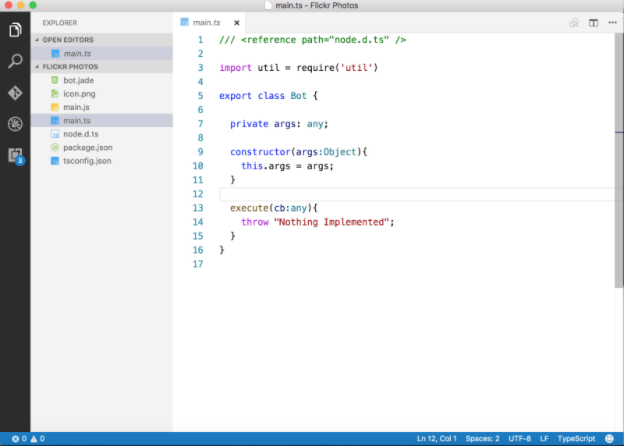

# Create the Bot

Create the bot by typing the following command in your windows or mac command prompt / terminal, while in your project folder:

    recime-cli create [FOLDER_NAME]
    

After you have provided this information, the cli will create the bot folder for you. In the directory where you created this bot, you now have a folder structure with these files:

Next, `cd` to your bot folder and open MAIN.TS with your favorite editor:

Before we continue to edit the MAIN.TS, we first need an API code from Flickr

