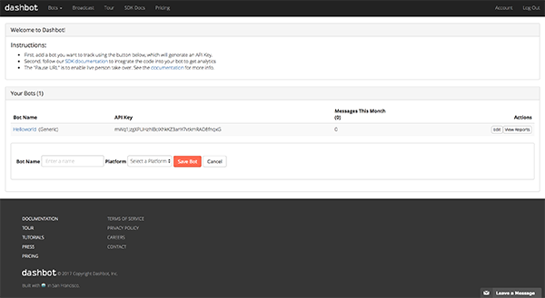

# Dashbot Analytics

[dashbot.io](https://www.dashbot.io) helps increase user engagement, acquisition, and monetization through actionable bot analytics. 

In order to get started, sign up with `dashbot.io` and create an API key for generic platform:



Once you have the API key and you are inside your project folder, type the following command:

```
recime-cli plugins add dashbot --apikey PASTE_YOUR_API_KEY_HERE

```

This will enable the bot for tracking analytics with `dashbot` as users interacts with it.

Once deployed, go to your `Dashbot` dashboard to check things like message count, top messages, sentiments, etc. that can help you optimize the bot for the right audience.


