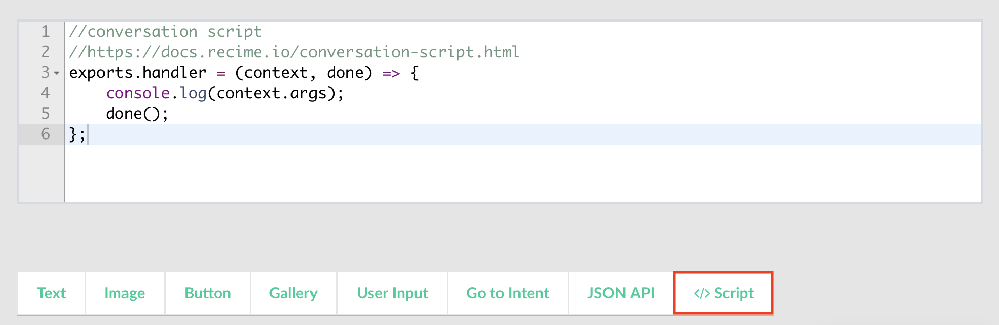
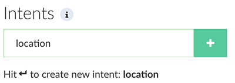
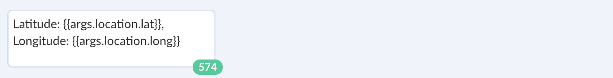
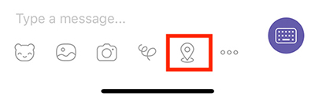

# Developer Features

## JSON API

The plugin allows you to create server-side integrations or define your conversation logic based on dynamic content. You can make the following HTTP requests:

* GET
* POST
* PATCH
* DELETE
* PUT

In addition, you can pass query string parameters, POST body, and headers to address a various type of custom implementation. It is possible to use user variables as parameters using the double braces syntax to pass user input and NLP response. Here is an example of how to use JSON API in order to pull data from a third-party API:


The response is saved in \{\{result}} variable. This can be used inside the text element to print out the result in the following way:


JSON API allows you to implement the following use-cases:

1. Retrieve dynamic content.
2. Create server-side integrations, where it will send data to an endpoint whenever a conversation reaches a certain point.
3. Trigger an event.

## Script Block

Script Block allows you to quickly write custom logic inside the conversation builder. Click on `script` button in the toolbar as shown below to insert a script block:





The entire conversation context is available in the script block. This will let you write custom logic based on user input, entities and variables. The example below shows how to pull data from a weather API and then set it as a context variable for use in the builder:

```javascript
//script block
//https://docs.recime.io/script-block.html
import request from 'request';

// get a free API key from openweathermap.org
const appId = 'PASTE_YOUR_API_KEY';

exports.handler = (context, done) => {
    request({
        url : 'https://api.openweathermap.org/data/2.5/weather',
        qs : {
            lat : context.nlp.entities.location[0].lat,
            lon : context.nlp.entities.location[0].lng,
            appid: appId,
            units: 'imeprial'
        },
        json : true
    }, (err, reponse, body)=>{
        if (err){
            console.log(err);
        }
        //debug
        console.log(body);
     
        // save 
        context.vars.set("weatherData", body);
        
        done();
    });
};

```

`context` parameter have the following properties:

| Property Name | Description |
| -- | -- |
| args | [User input]
| nlp |  Contains entities and intents for an expression.
| vars | Set or get vars to use in the current context.


The `args` object contains the following properties:

| Property Name | Description | Type |
| -- | -- | -- |
| sender | Unique sender ID | String |
| text | Input text.(e.g. Where is San Francisco?) | String |
| event | Event to trigger an intent. Either text or event is required. | Object |


`event` contains the name of the event that is triggered for a user action:

| Property Name | Description | Type |
| -- | -- | -- |
| name | Name of the event (e.g. start) that corresponds to an intent name | String |


You can use variables inside the builder in the following way using the double braces syntax:


You can also output in script block using the [extension module](https://github.com/Recime/recime-bot-extension) in the following way:


```javascript
import Ext from "recime-bot-extension";
const __ = Ext.default;

exports.handler = (context, done) => {
    done(__.text("Hello world"));
};
```

Script block can be useful in the following scnearios:

* Retrieving data from your existing API that you want inject in your conversation context.
* Construct dynamic response based on user input and entities.


The following libraries are available in the **Script Block** runtime:

* [node core](https://nodejs.org/api/modules.html#modules_core_modules)
* [request](https://github.com/request/request)
* [recime-bot-extension](https://github.com/Recime/recime-bot-extension)
* [recime-keyvalue-store](https://github.com/Recime/recime-keyvalue-store)
* [moment.js](https://momentjs.com/)

## Capturing User Location

Facebook, Viber, and Telegram allow the user to send a location to your bot. It is sometimes useful to capture user's location in order to book an appointment, order a pizza, etc.

When user sends a location, it triggers a `location` intent or goes to the `default` intent. Create a location intent by typing "location" into search box in the following way:



User location is sent as an input parameter and it can be accessed as an attribute in the following way:



Basically, a location has the following properties regardless of the platform:

| Name | Description|
| -- | -- |
| lat  | latitude |
| long | longitude|

Please, check out the following resources on how to send your location:

[How can I send my current location in Messenger](https://www.facebook.com/help/messenger-app/1394730427523556)


In Viber, it is available as a toolbar button, clicking on it will bring up the map to pin your location:



In Telegram, tap on the attachment button and choose Location:


## Reusable Custom Modules (Coming Soon)
Publish re-usable custom modules using the Command Line Interface.
