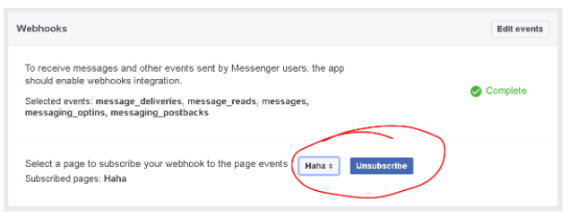

# Facebook App ID

Login to your developer account (developers.facebook.com) and create a new Facebook App (click profile picture) of the category: **MESSENGER BOT**. 

Scroll down on the App Dashboard to “Setup Webhooks”

The Webhook has to contain the bot / callback URL you got from the `deployment` terminal / command prompt.

The verify token (bot identifier) is the token you can get from the bot page on Recime.ai. For that, log in to recime.ai, click on your user name top right, and click on your deployed bot. 

Select the subscription fields required for the bot:

Click “Verify and Save”

On the Facebook developers page you can now generate a token from Facebook to put in the Recime bot on the Recime.ai website as “Access Token” 

Enter the Access Token you just got from Facebook on the Recime bot page.

Enable webhook subscription on the facebook website for the page you have created above. This is required by facebook to send notification from third-party services.

Select your page to subscribe your webhook to the page events.

That's it your bot is now ready to accept requests. You can add it to your Facebook message app or message it directly from the Facebook page you have created or search for it on the messenger app. 
If you want other people to use it, add them as tester on your Facebook developer bot’s page, or publish the bot.

Please check out [Facebook Messenger Platform](https://developers.facebook.com/docs/messenger-platform) documentation for details on how to setup your app and constructing conversation object.

