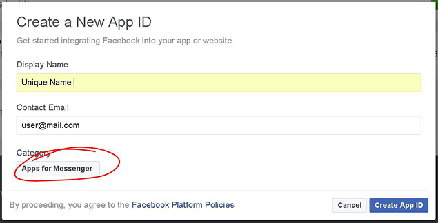
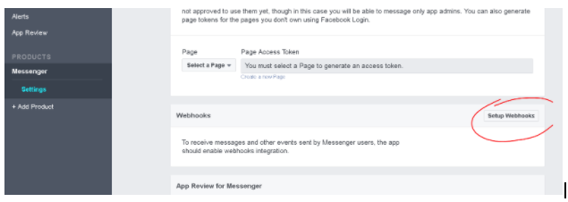
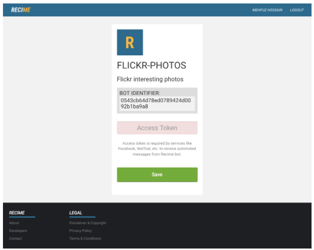
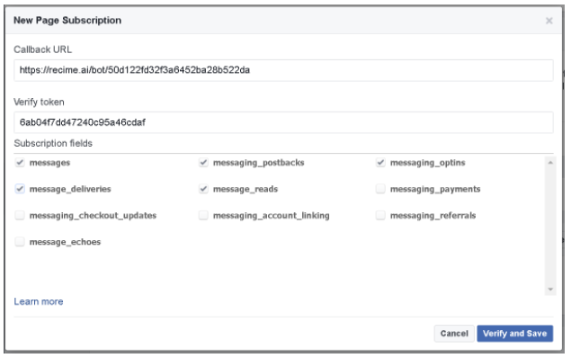
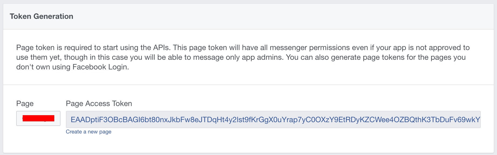

# Facebook App ID

Login to your developer account \(developers.facebook.com\) and create a new Facebook App \(click profile picture\) of the category: **APPS for MESSENGER**.

Scroll down on the App Dashboard to “Setup Webhooks”

Put in the bot URL from the deployment terminal / command prompt in the Webhook callback URL.

The verify token \(bot identifier\) is the token you can get from the bot page on [recime.io](https://www.recime.io). For that, log in to your account, click on your user name top right, and click on your deployed bot.

Select the first five subscription fields:

Click “Verify and Save”

On the Facebook developers page you can now generate a token from Facebook to put in the Recime bot on the [recime.io](https://www.recime.io) website as “Access Token”

Enter the Access Token you just got from Facebook on the Recime bot page.

