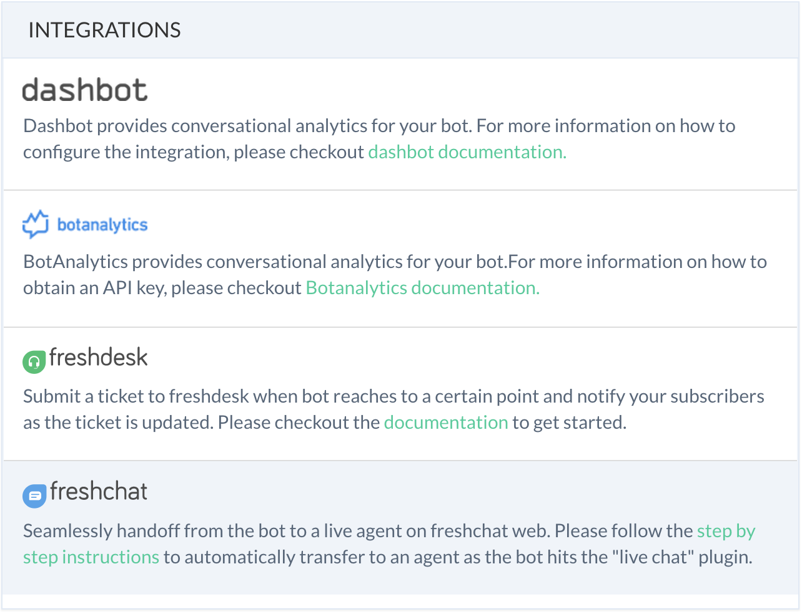
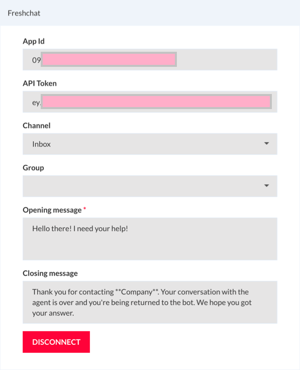

# How to use Freshchat as a live agent from Smartloop bot

## Install Template

First, you'll need the [Freshworks Template](https://templates.smartloop.ai/v1/4d07a090cfb011e980d2bbfc29bc501b). Follow the instructions to install it in your account. We will be using it as a starting point to integrate a messenger bot with Freshdesk.

## Customize the Template

To configure settings in the Smartloop bot, click on "Configure" button.

Click on Freshchat link from `Configure -> Integrations` section:

This will bring up the step-by-step wizard to complete the integration

You will need to provide values in the box above as follows:

`App Id`: You will get this value from [Freshchat portal](https://web.freshchat.com). Login to your Freshchat account, go to Settings -> Account Settings -> Integration Settings. Copy the *App Id* from the *Agent Widget* section to the App Id in the Smartloop bot:

`API Token`: While in Freshchat portal, go to Settings -> API Tokens. Click on "Generate Token" and copy this. 

This token value should be copied in the *API Token* text box of Smartloop portal.

`Opening message`: This is the message that the agent would see when user initiates the live chat.

`Closing message`: This is the message that user would see when an agent marks the conversation as resolved.

::: tip
Please make a note of the `Freshchat Webhook` value that we will use in the next step.
:::

## Configure Freshchat settings

Login to your Freshchat account, go to Settings -> Webhooks. Use the Freshchat Webhook copied in the earlier step and enter it in the Webhook text box:

Click "Save" to continue.
