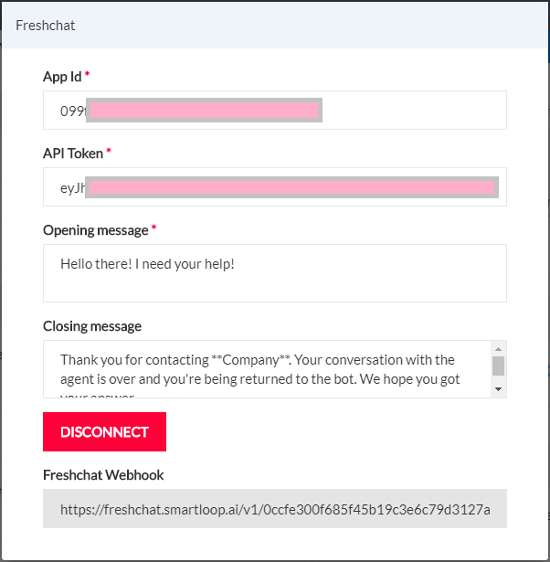
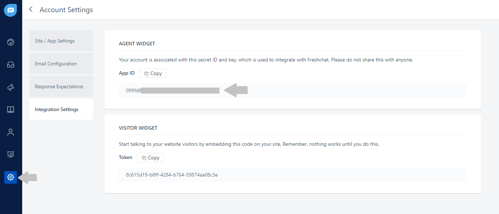
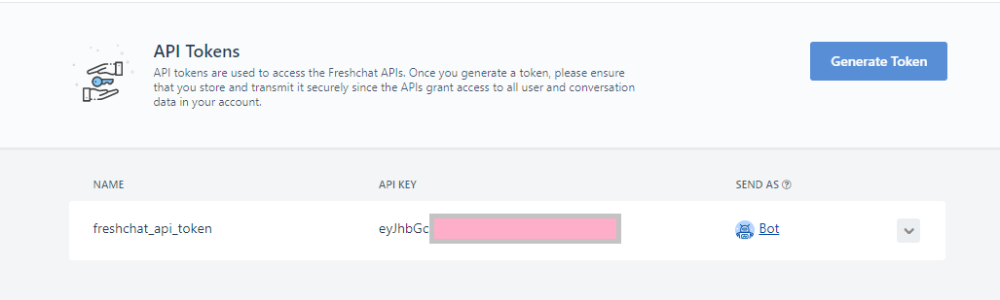
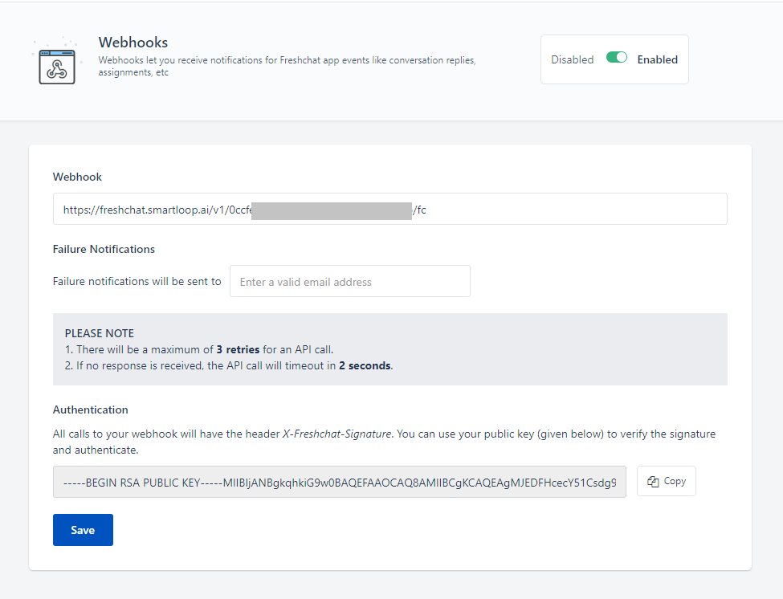

# How to use Freshchat as a live agent from Smartloop bot

## Making changes in the Smartloop bot

To configure settings in the Smartloop bot, click on "Configure" button.

Scroll down and find the **CONFIGURATION** section. 

Make sure that the Key `GRAPHQL_URI` exists with value: `https://freshdesk.smartloop.ai/v1/`

If this key doesn't exist, create a new key value pair with the above settings.

Find the **THIRD-PARTY INTEGRATION** section. 

Click on the **Freshchat** icon. This will open up a modal box as shown. 

You will need to provide values in the box above as follows:

`App Id`: You will get this value from [Freshchat portal](https://web.freshchat.com). Login to your Freshchat account, go to Settings -> Account Settings -> Integration Settings. Copy the *App Id* from the *Agent Widget* section to the App Id in the Smartloop bot:

`API Token`: While in Freshchat portal, go to Settings -> API Tokens. Click on "Generate Token" and copy this. 

This token value should be copied in the *API Token* text box of Smartloop portal.

`Opening message`: Use the default message included or provide your desired message.

`Closing message`: Use the default message included or provide your desired message.

::: tip
Please make a note of the `Freshchat Webhook` value that we will use in the next step.
:::

## Configure Freshchat settings

Login to your Freshchat account, go to Settings -> Webhooks. Use the Freshchat Webhook setting copied in the earlier step and enter it in the Webhook text box:

Click on the Save button.