# How to integrate Freshdesk with Smartloop bot

## Getting Started

Copy this link in your browser to get the template in your bot workspace: 
[Freshdesk Template](https://dashboard.smartloop.ai/templates/4d07a090cfb011e980d2bbfc29bc501b)

If you don't have an account on Smartloop yet, you will be asked to create a new account on Smartloop.

A new *Facebook* bot will now be created in your account. We will be working with this bot.

## Making changes in the Smartloop bot

To configure settings in the Smartloop bot, click on "Configure" button.

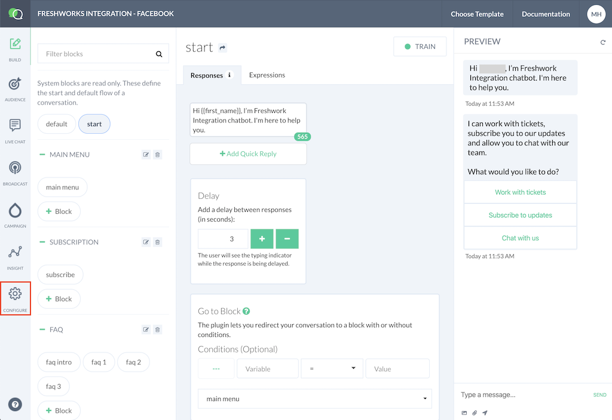


Scroll down and find the **CONFIGURATION** section. 

Make sure that the Key `GRAPHQL_URI` exists with value: `https://freshdesk.smartloop.ai/v1/`

If this key doesn't exist, create a new key value pair with the above settings.

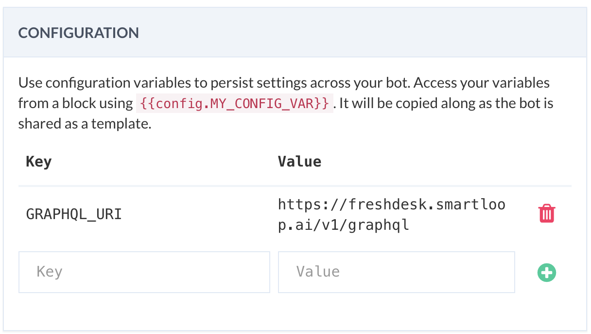

::: tip
These values need to remain as is. No change is required in them.
:::

Scroll up a little and find the **THIRD-PARTY INTEGRATION** section. 

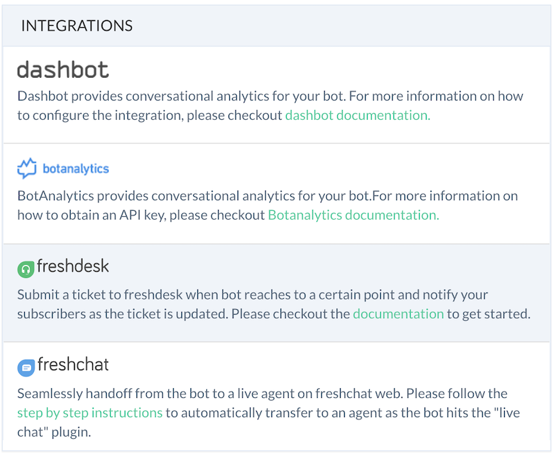

Click on the **Freshdesk** iocn. This will open up a modal box as shown. 

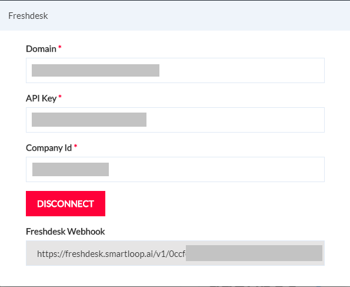

We need to enter relevant values from Freshdesk here.

`Domain`: This is the URL of your Freshdesk home e.g. smartloophelp.freshdesk.com

`API Key`: To get the API key, log into your Freshdesk account. Click on your username and then Profile Settings. The profile page consists the API Key as shown below. Copy and paste this key in *API Key* settings in Smartloop.

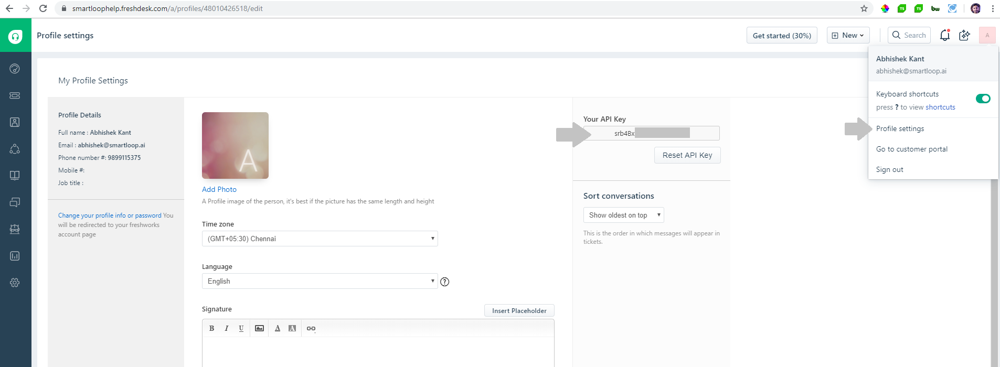

`CompanyId`: Continuing in Freshdesk, click on the People icon, followed by Companies:

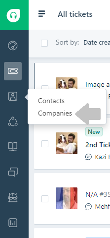

Once on the Companies page, click on the name of your company (default is Acme Inc.). This will open up your company profile. Copy the company ID from the URL from the browser address section as shown below:

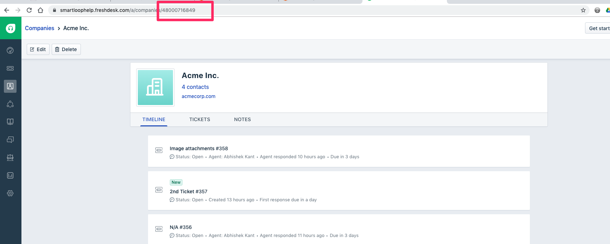

This value will need to be copied in the *CompanyId* text box.

Save the values by clicking on the *Connect* button.

An important value that needs to be copied from this screen is the API key found in the **API Access** section as shown below:
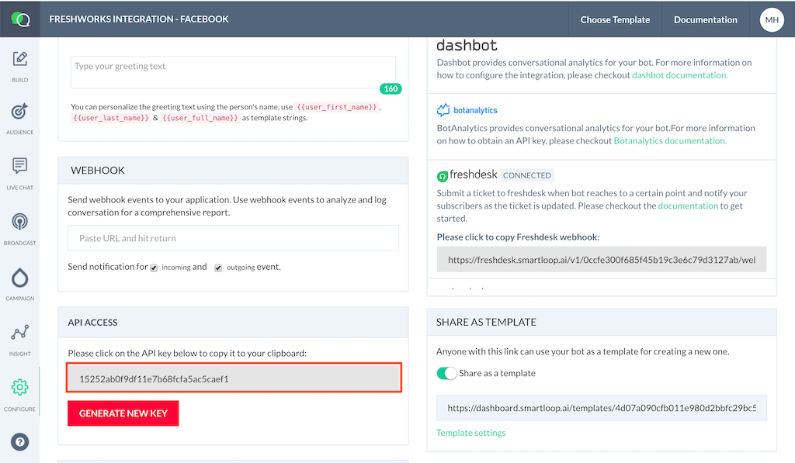


::: tip
Please make a note of the `Freshdesk Webhook` value that we will use in the next step.
:::


## Configure Freshdesk to send update notifications to Smartloop

Login into your Freshdesk account. 

Click on Admin icon, followed by Automations. On the automations page, switch to Ticket Updates tab as shown below:

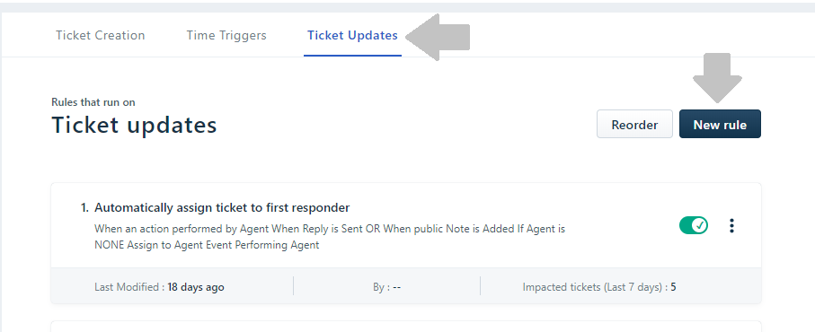

Click on the New Rule button. 

In the *When an action performed by* section, make sure that Agent is selected as below:

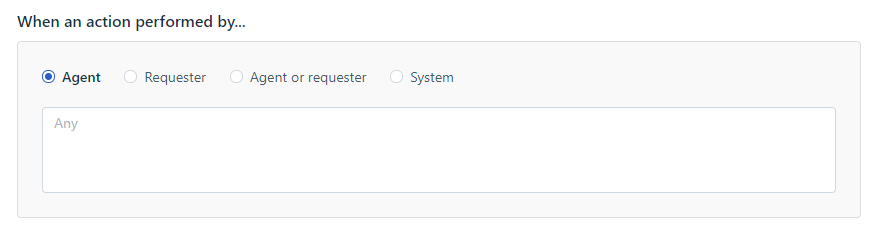

In the *Involves any of these events*, include settings for responding to any reply and status update as shown:

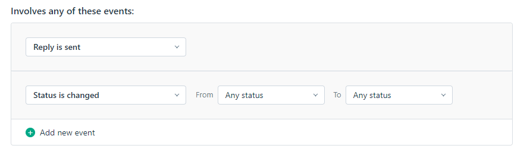

In *Perform these actions*, add a new Trigger Webhook with Request Type set to POST. In the URL, paste the Freshdesk Webhook you copied in the earlier step. 

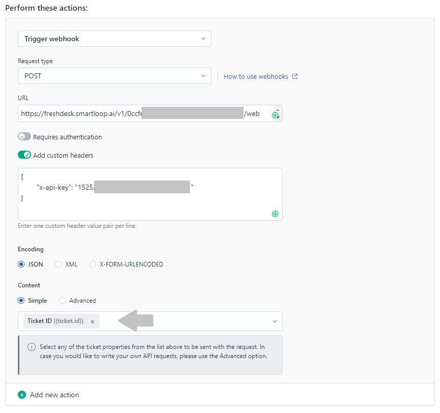

Please include the following JSON in the custom headers:
```
{
	"x-api-key": <Smartloop API key>
}
```
This API key is the one that was copied earlier from the **API Access** section of the Smartloop Configure section.

Further would need to include the following two attributes in the Content section - Ticket ID and Triggerd Event as shown below:

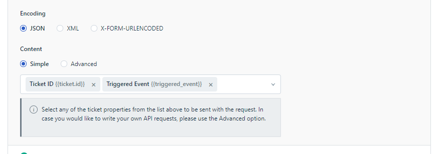

Click on **Preview and save** to save the settings on Freshdesk page.

Finally, [publish this bot to Facebook](./publish.md)