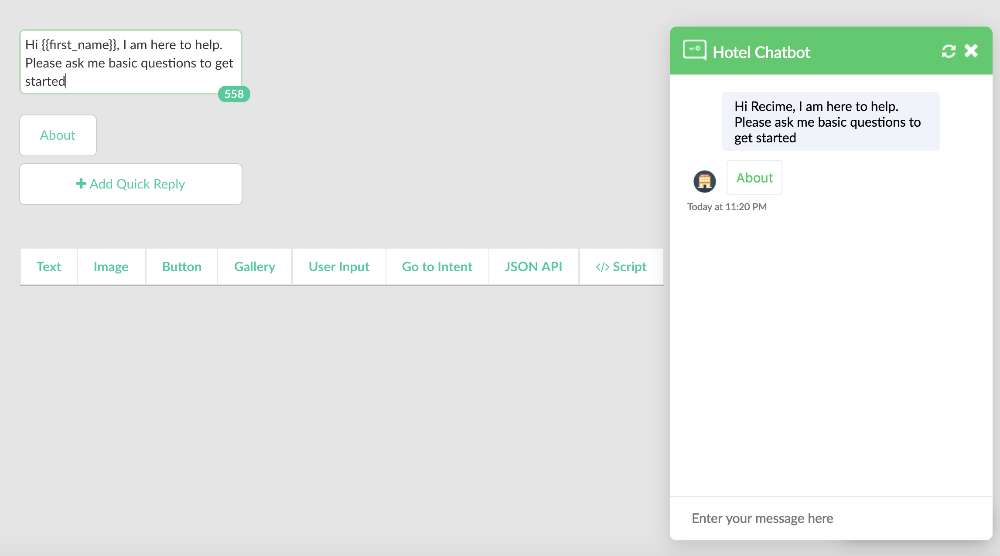

# Getting Started Tutorial

Once you are on the dashboard page, press the "+ Create a bot" button. 

Enter title, description of the of the bot. Upload an icon (256x256), choose your channel and language. 

Press "Submit".

This will create a bot using the default template with `start`, `default` and `about` block. 

Blocks are the building blocks of your bot. A block contains expressions and responses. You can also trigger a block by a user event (e.g.button click) or by user input.

Here is the definition of the blocks that are the building blocks of your bot.

| Name | Description | Required |
| - | --- | - |
| start | Defines the start of the conversation. It is called automatically when the conversation starts | Y |
| about | it is triggered when some types "about" or by a user event.  This contains the information about your bot.  | N |
| default | Contains default message shown to a user when the bot does not understand an expression. This is useful for initiating a support flow. | Y |

Go to the "Responses" tab, make some changes and test your bot in real-time.

Next, click on the publish icon from the navigation bar, follow the instruction and connect your bot to a channel.

