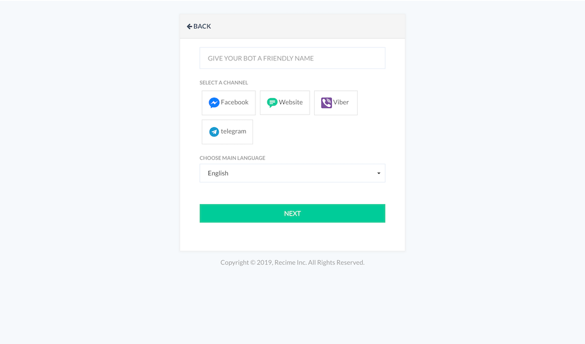
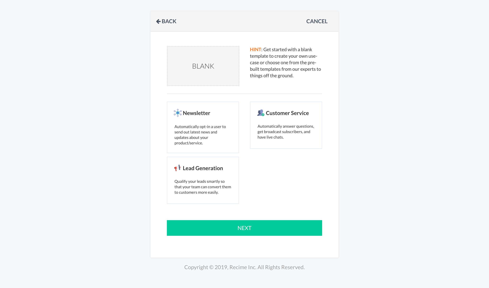
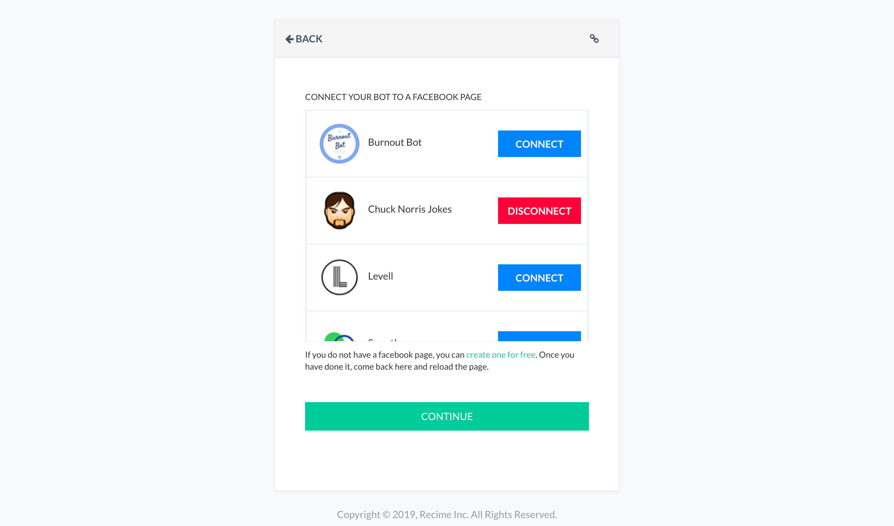
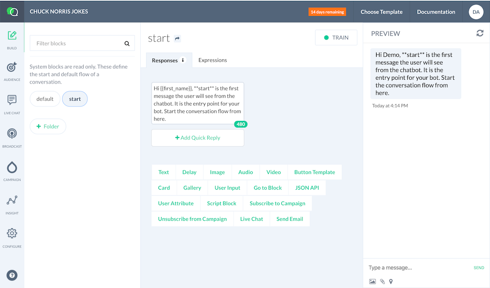
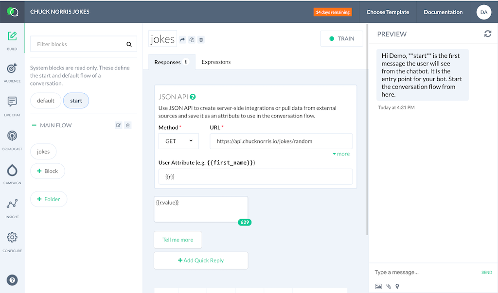

# Getting Started

In this tutorial, you will create your very own facebook messenger bot. 

Use [Facebook](https://www.facebook.com/) or [create a new account](https://dashboard.smartloop.ai) using a valid email.Once inside the dashboard, press the *"+"* thumbnail to get started:

This will bring up the step by step wizard:

Enter the bot title, select a platform. In this case, “Facebook”.  

Click “Submit”.

On the next step, you will choose a template or start from a new bot. In this case, select "blank bot":

Click "Next".

Connect your bot to a page; if you are not already logged in using Facebook, it will guide you through the process:

Click "Continue".

::: tip What is a block?
A block contains expressions and responses. You can also trigger a block by a user event (e.g.button click) or by user input 
:::

This will create the bot and take you to the conversation builder once completed.

Once, you are inside the builder; the next step is to build a flow. First, customize the greetings message followed by a quick reply in the following way:

Click on the quick reply button, this will bring up the context dialog, select "User Input" as type and "yes" as reply:

Create a flow to navigate the user to different flows based on user input. First, capture the user input using the [User Input](capturing-user-input.html) plugin in the following way:

Next, send the user to a specific block using the [Go to Block](redirect-using-go-to.html) plugin. Create an empty block “jokes” and send the user to it based on the user input as shown below:

Inside "jokes", add a JSON Plugin to pull random jokes and store it in a user variable in the following way:

Print the joke using a text block in the following way:

Go to the "start" block and add an alternate flow with information on driving your user to the main loop:

That's it, you have created your first "Chuck Norris" bot.

 

Go to your page, click on the “+ Add a Button” and select "Contact us/ Send a Message". In the next step, as where to send the users, choose “Facebook Messenger” to respond.

Once the button has been added, hover over it and select “Test Button”. This will bring up the bot and click on “Get started” to chat with the bot.

If you have completed the step, then you are have successfully created and published your first Facebook bot. 

Next,  check out [Basic Concepts](basic-concepts.html) section for a deep dive on blocks and various chatbot concepts. 

