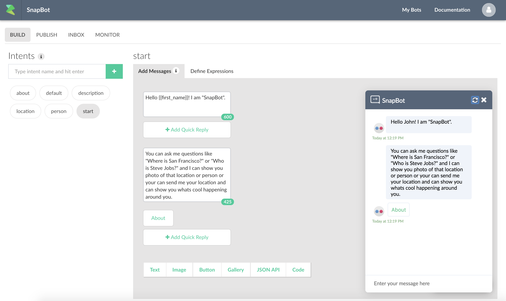
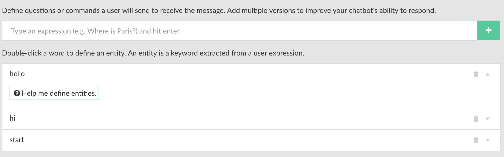

# Getting Started

Once the account is created. Next step is to create your first bot. 

Once you are in your dashboard, press the "+ Create a bot" button. This will give you the create bot dialog:

Enter title, description of the of the bot. Upload an icon (256x256) and finally choose your language. 

Press "Submit".

This will create a blank bot with `start`, `default` and `about` intent. 

Intents are the building blocks of your bot. An intent contains conversation blocks and expressions that can trigger it. You can also trigger an intent by an user event like button click.

Here are the definiation of the basic intents that are the building blocks of your bot.

| Intent Name | Description | Required |
| -- | -- | -- |
| `start` | Defines the start of the conversation. It is called automatically when the conversation starts | Y |
| `about` | The intent is callled when some types "about" or any about event triggered by the user.  This contains the default branding information.  | N |
| `default` | Contains default message shown to a user when the bot does not understand an expression. | Y |

Test your bot by clicking on the "Test the Bot" button.

You can define expressions from "Define Expressions" tab. The default template already creates a few for you. In this case, messages in `start` intent can also be triggered by typing "Hi", "Hello" or "Start". 

