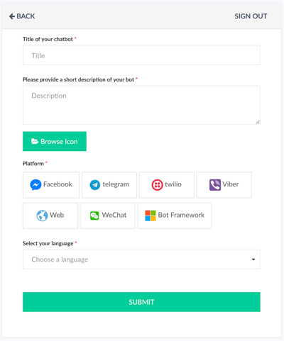
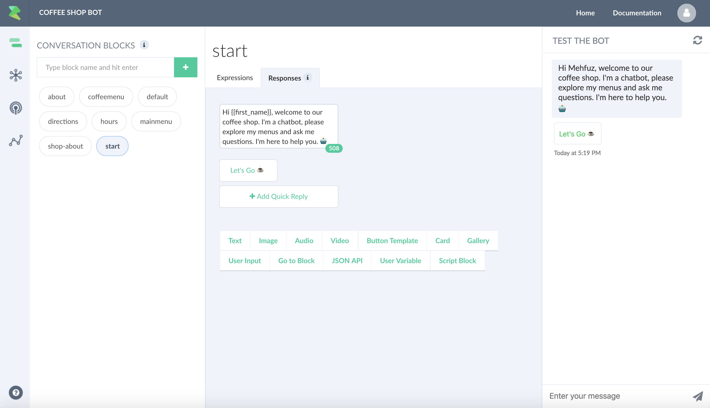

# Getting Started Tutorial

Once you are on the dashboard page, press the "+ Create a bot" button. 

Enter title, description of the of the bot. Upload an icon (256x256), choose your channel and language. 

Press "Submit".

This will create a bot using the default template with `start`, `default` and `about` block. 

Blocks are the building blocks of your bot. A block contains expressions and responses. You can also trigger a block by a user event (e.g.button click) or by user input.

Go to the "Responses" tab, make some changes and test your bot in real-time.

Next, click on the publish icon from the navigation bar, follow the instructions and connect your bot to a channel.

Next, check out [Building a Bot](building-a-bot.html) section for a deep dive on blocks and various chatbot concepts. 

