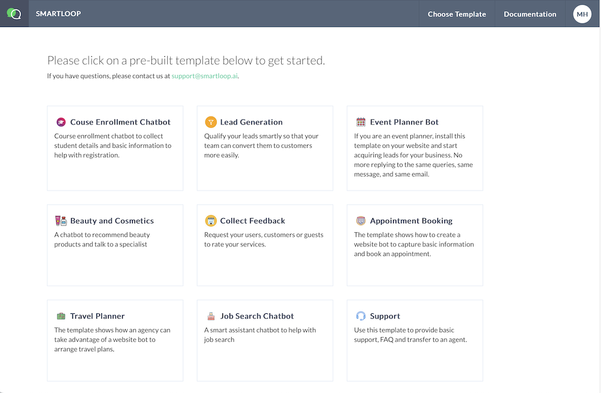
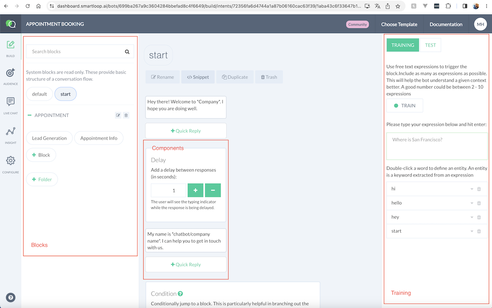
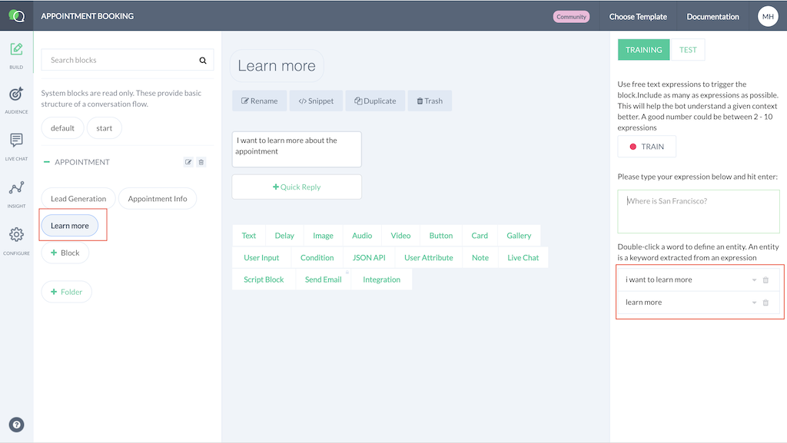
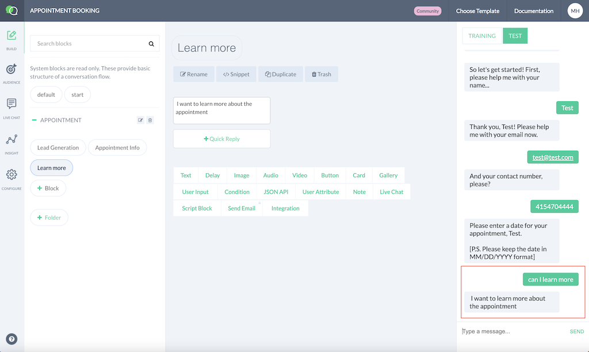
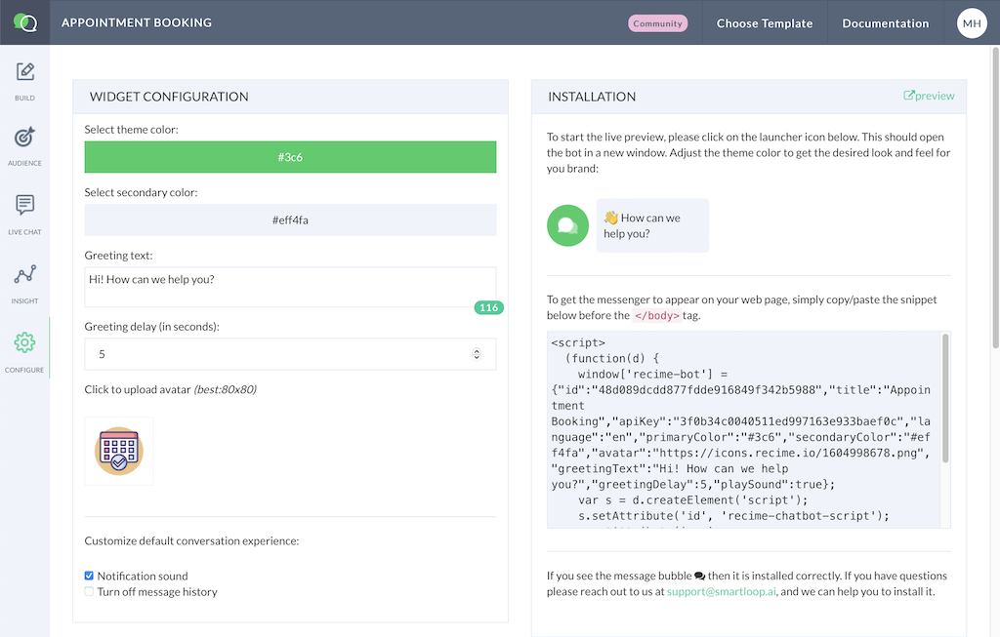

# Getting Started

In this tutorial, you will learn how to create and deploy your first website bot. This assumes that you have already created an account in `smartloop` platform.

If you have not yet, you can do it so here:

[Registration](https://dashboard.smartloop.ai/sign-up)

Once you have created and verfiied your account, you will be presented with a templates page:

For this example, let's pick `Appointment Booking` template. Once, you click, it will bootstrap the bot and take you to the conversation builder page:

Conversation builder is composed around these three key elements:

* Blocks
* Components
* Training

I will recommend to go over the [Basic Concepts](basic-concepts.html) of the documenation to familiarize about the various concept around conversation AI and tweaking your chatbot

Now, lets adds a `learn more` block and some expressions to trigger it:

Here, I've created a `Appointment -> Learn More` block, add a text component and added the following expressions:

* Learn more 
* I want to learn more

You will notice that the train button is `red`, this means that the bot requires training in order for the expressions to take effect

Click "Train".

In a few seconds, you should receive an email that the training is complete and after you can test the bot from the "test" section:

Here, I have used `can I learn more` which is different from what I used for trained, the chatbot uses deep learning to inference between expressions, in this way, even it is not a 100% match it will still understand the expression

Next, lets deploy the bot

In order to deploy the bot, lets go to `settings-> installation`. Here, you can customize the color, icons, etc. to reflect your brand. Once completed just copy an paste the script to your website. 

You can learn more in the [configuration](configuration.html) section of the documentation on how to modify look and feel, deploy properly and customize various attributes that you can use to tweak your bot.

Once completed, you are all set, you just created and deployed your first website bot using `smartloop` platform

If you have questions, please ping us at [Support](mailto:support@smartloop.ai) and we would be more than happy to help you in your journey

