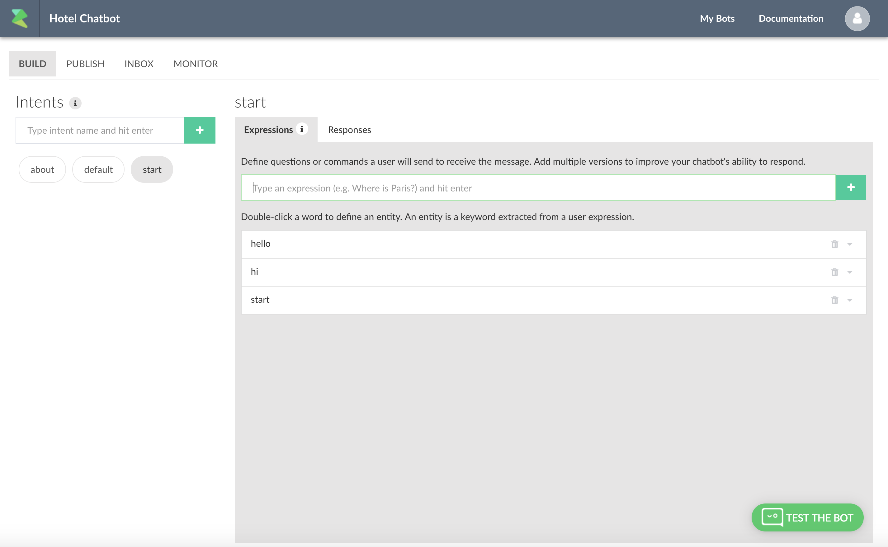

Getting Started
===============

Once the account is created. Next step is to create your first bot.

Once you are in your dashboard, press the "+ Create a bot" button. This
will give you the create bot dialog:

|image0|

Enter title, description of the of the bot. Upload an icon (256x256) and
finally choose your language.

Press "Submit".

This will create a blank bot with ``start``, ``default`` and ``about``
intent.

|image1|

Intents are the building blocks of your bot. An intent contains
expressions and responses. You can also trigger an intent by a user
event (e.g.button click) or by typing the expression or keyword that you
have defined in the "Expressions" tab.

Here is the definition of the basic intents that are the building blocks
of your bot.

+-----------------------+-----------------------+-----------------------+
| Intent Name           | Description           | Required              |
+=======================+=======================+=======================+
| start                 | Defines the start of  | Y                     |
|                       | the conversation. It  |                       |
|                       | is called             |                       |
|                       | automatically when    |                       |
|                       | the conversation      |                       |
|                       | starts                |                       |
+-----------------------+-----------------------+-----------------------+
| about                 | it is triggered when  | N                     |
|                       | some types "about" or |                       |
|                       | by a user event. This |                       |
|                       | contains the default  |                       |
|                       | branding information. |                       |
+-----------------------+-----------------------+-----------------------+
| default               | Contains default      | Y                     |
|                       | message shown to a    |                       |
|                       | user when the bot     |                       |
|                       | does not understand   |                       |
|                       | an expression. This   |                       |
|                       | is useful for         |                       |
|                       | creating an email or  |                       |
|                       | support flow          |                       |
+-----------------------+-----------------------+-----------------------+

Go to the "Responses" tab, make some changes and click on the "Test the
Bot" button.

|image2|

Go to Publish tab to connect the bot to your Facebook page, `Viber`_ or
`WeChat`_ public account, Telegram using `BotFater`_ app, copy the
script to your website.

|image3|

.. _Viber: https://partners.viber.com/account/create-bot-account
.. _WeChat: https://mp.weixin.qq.com/
.. _BotFater: https://telegram.me/botfather

.. |image0| image:: create-new-bot.png

.. |image2| image:: test-the-bot.png
.. |image3| image:: publish-facebook.png