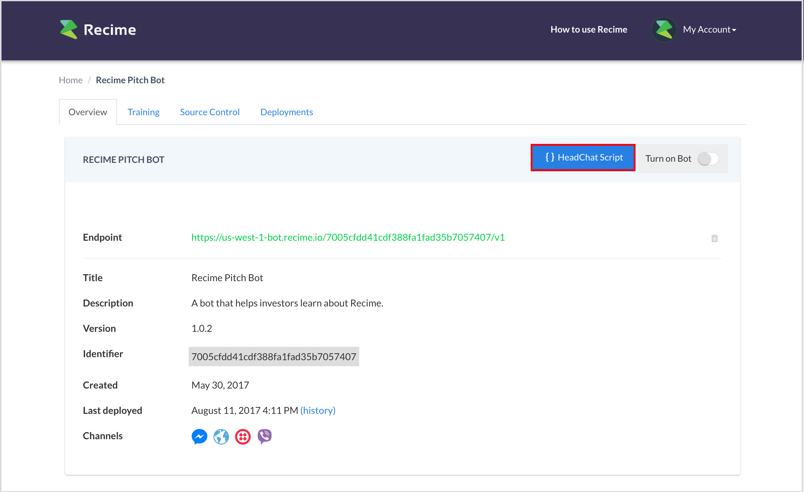
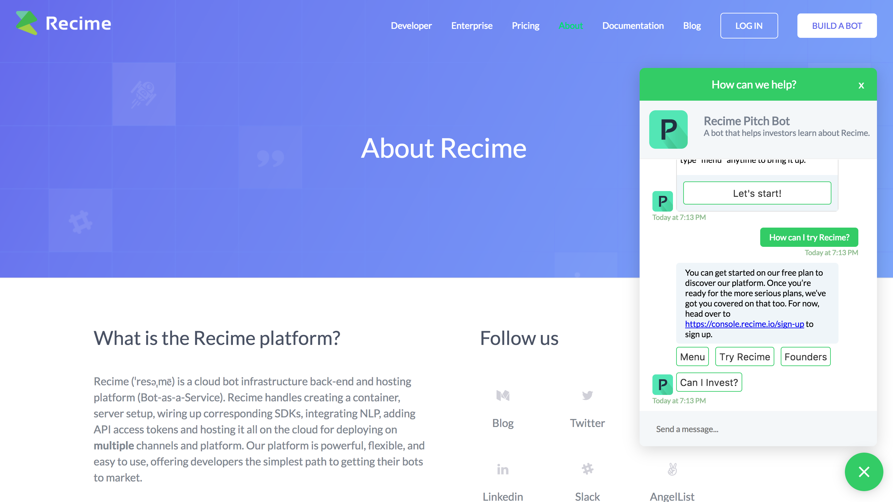

# HeadChat - Beta

Now you can take your chatbot and deploy to it your website in just a few steps. 

Once you have deployed the bot. You can do it by going to your [console.recime.io](https://console.recime.io) dashboard and copying the script by clicking the `headchat` button as shown below:

To get the messenger to appear on your web page simply paste the snippet before the `</body>` tag. That's it, you should now see the `headchat` icon and clicking on it will open up the conversation dialog.

It supports most of the Facebook `metadata` and your Facebook chatbot should work without a single line of code change. If you are using the `recime-bot-extension` npm package then all of these should be taken care of automatically.

