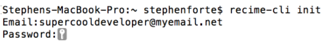
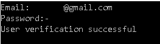

# Initializing the CLI

You can do so by executing the following command in the Terminal window:

    recime-cli login

This will prompt you to enter your verified email and password that you used to register at `recime.io` . It is important that once you create the recime account, you follow the steps in email to verify your account. You will need it to publish/deploy and track the usage of your bot.

Once the process is complete it will tell you that it was successful.

