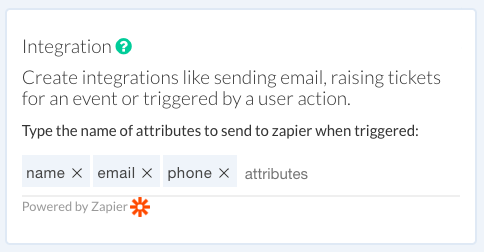

# Integration

::: warning Not supported in Test mode
You will need to test `Integration` in the bot itself. It will be skipped in the test bot.
:::

Create integrations like sending email, raising tickets for a bot event or triggered by a user action.

Integration is supported via `zapier` can be effective in the folloiwng scenarios:

* Capture your subscriber details via the "Integration" plugin
* Trigger events like creating support tickets automatically

Here, we will cover a basic flow on how you can export subscribers to a google sheet and then send a confirmation back with an email to demonstrate the integration and setup

The very first step, while in the conversation builder, add the "Integration" plugin in the `start` block in order to trigger the event.

Next, go to [Zaiper](https://zapier.com) and create a new zap as shown here:

Select "New Zap Event" from the options and click "continue"

Click "Sign in to Smartloop", this will bring up the auth dialog and choose the bot you want to connect.

For this demo, I will select `Promotions Bot` (created from a default template)

To test your trigger, send a message (e.g. hi) to your to bot.

Continue to complete the step.

Create a "Google sheets" step, to create a spreadsheet row, every time a new event is raised. 

Map the fields you want to capture, in this demo we are just capturing the *user_id* and attributes containing user details from the event:

We can turn on the zap at this step. We are also going to add an additional step that will send a notification to the user as a confirmation.

Select "Send Notification" as an action event:

Next, create a map to the `user_id` we captured in step one:

Test and confirm that you have recevied the test event

Turn on the zap.

At this point you have successfully configured your zap using smartloop conversation platform.

---

Please reach out to [support@smartloop.ai](mailto:support@smartloop.ai), if you have questions or can't get through the steps and we will be happy to help you.

