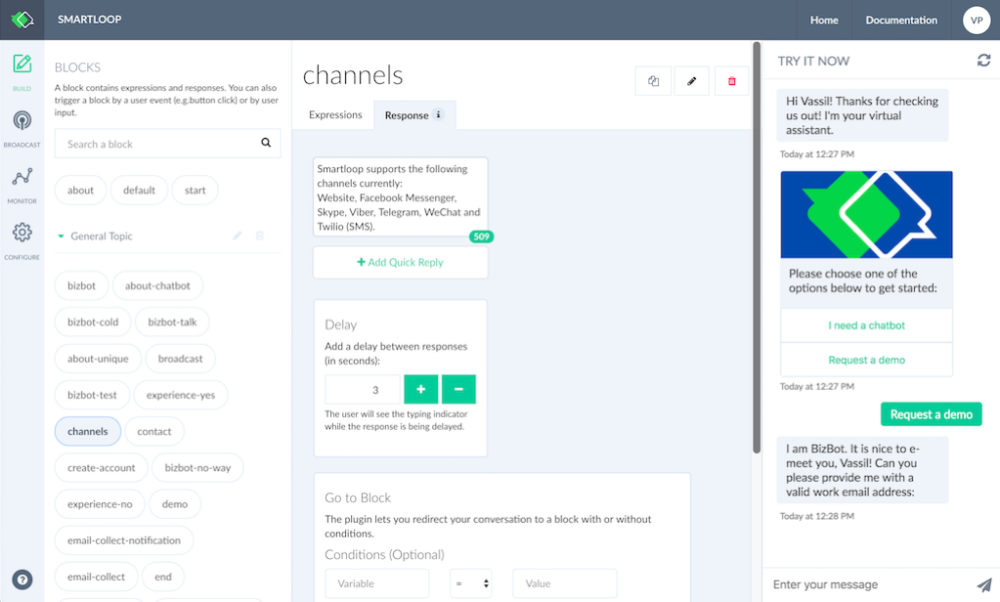

# Introduction

Smartloop is an end-to-end chatbot platform to automate customer support, content distribution and automate marketing flow. Create omni-channel chatbots quickly and easily, measure growth, save cost and increase customer satisfaction.

Channel support and capabilities:

| Channel | Supported | Broadcast | 
| - | - | - |
| Alexa | - | - |
| Facebook Messenger | Y | Y | 
| Microsoft Bot Framwork | Y | N | 
| Telegram | Y |  Y | 
| Twilio | Y | Y |
| Twitter | - | - | 
| Web | Y | N |
| Viber | Y | Y |
| WeChat | Y | Y | 

The platform offers you full advantage of the range of structured and rich message types these channels have to offer, all via one easy-to-use and consistent interface.

If you have any questions, don't hesitate to reach out to us at [hello@smartloop.ai](mailto:hello@smartloop.ai)

[[toc]]