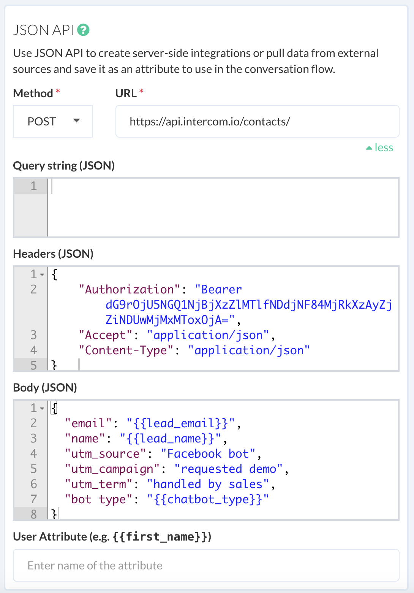

# Integrations using JSON API

It is possible to integrate with your back-end using JSON API api plugin. It allows you to take data out of the bot to your CRM or spreadsheet. You can use JSON API plugin to integrate with any REST API endpoint and supports the following methods:

* GET
* POST
* PUT
* DELETE

Below is an example of JSON API in action, this is an example of a bot that capture lead information and sends it over to a CRM to further processing.

It is possible store the result returned from the server to a user attribute. This can be useful in implementing conditional logic based on dynamic values  

In a nutshell, JSON API plugin allows you to implement the following use-cases:

1. Retrieve dynamic content.
2. Create server-side integrations, where it will send data to an endpoint whenever a conversation reaches a certain point.
3. Trigger an event.
