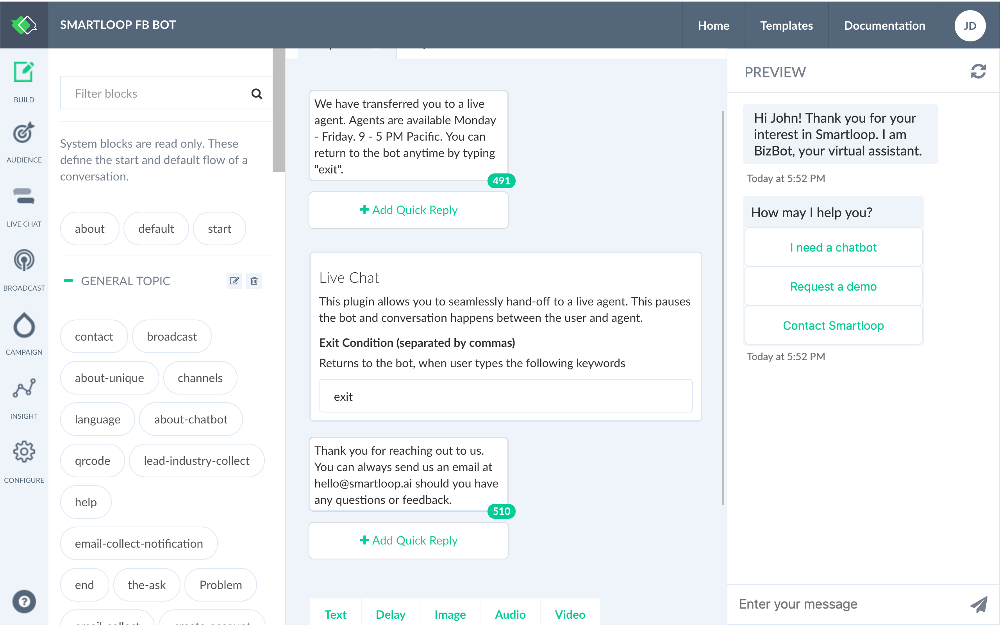
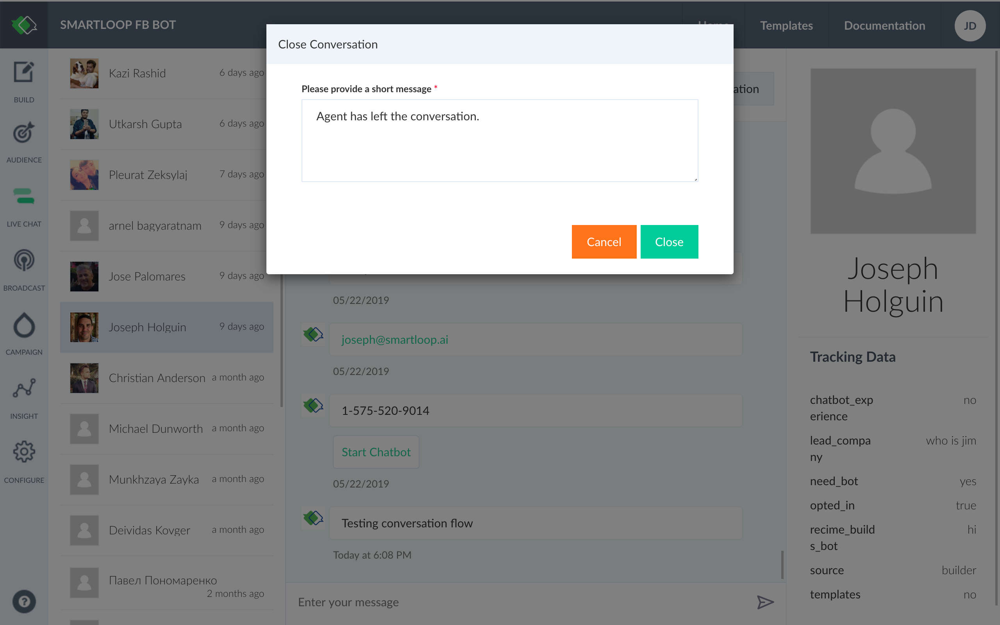

# Live Chat

Seamlessly handoff to an agent without leaving the bot. Agent flow can be triggered either by "Live Chat" plugin where it will pause the bot and communication happens between the user and the agent directly or an agent can take over a conversation in scenarios where the user falls off-track or stuck at a particular flow.

## Using Live Chat Plugin

While in the conversation builder click to add the live chat plugin to your workspace as shown below:

The plugin will pause the bot and trigger live chat. User can leave the conversation anytime in this case by typing "exit". This will close the conversation and activate the bot from where the user left off. The keyword can by anything specified by you separated by commas.

## Taking Over a Conversation

Agent can take over a conversation anytime by sending a message directly from the conversation viewer. In this case, agent will have to manually close the conversation by clicking on the "Close Conversation" button on the top right corner of the conversation pane.

Live Chat is a great way to design the conversation flow in a way where bot handles tier 1 questions where based on profile, attributes, user is seamlessly handed off to an agent to handle complex scenarios. Agents can also use the conversation viewer as a tool to understand their subscribers and improve the bot overtime.