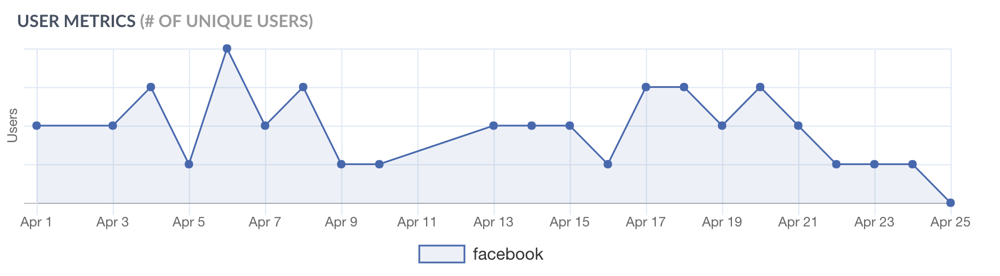
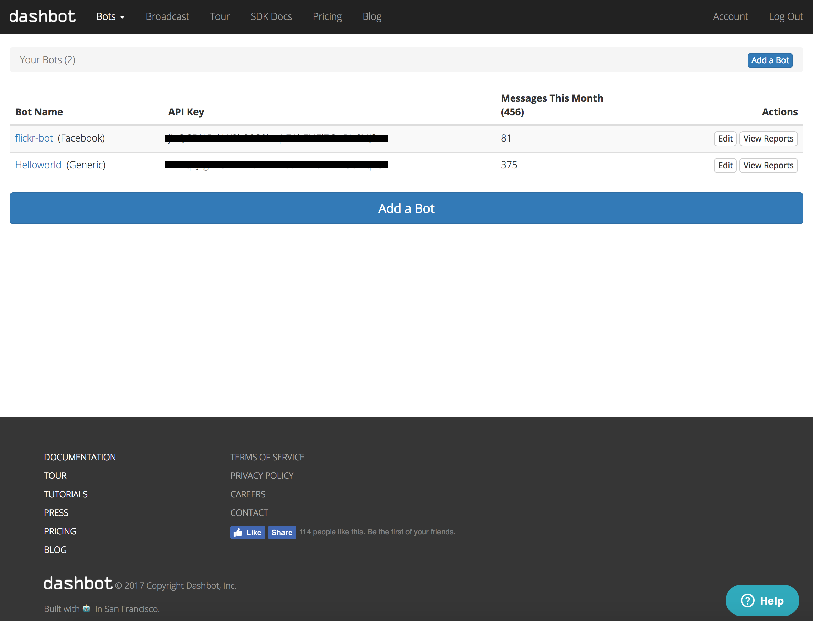

# Monitoring a Bot

Use analytics data to track conversational data and fine-tune the bot using various key elements over a period of time. Click on the monitor icon from the navigation bar to track the following key metrics:

### Conversational Timeline

Gives an overview of the total number of conversation over a period of time. A conversation is a message between a user and the bot.

### User Metrics

A number of unique users in your bot for a given period. A unique user or subscriber count is increased when a user interacts with the bot for the first time. 

### Top Blocks

Gives an overview of the most popular blocks of your bot. This helps you understand the relevance of a given flow against your user base as more people interacts with it.

 

### Missed Conversation

Missed conversation is the opposite of top blocks. It gives you an overview the messages that bot didn't recognize and their frequency. Missed conversations are calculated as the bot hits the `default` block. This means that the confidence level of a user expression does not satisfy any given blocks.

 

## Dashbot Analytics 

In order to get more insights for your bot, connect the analytics powered by [dashbot](https://dashbot.io).

Dashbot is the leading bot analytics service providing the most accurate and in-depth insights of your bot conversation. 

First step is to create a free account in [dashbot](https://www.dashbot.io) and then [add a skill](https://www.dashbot.io/bots):

Once the skill is created, it will generate an API key. Paste the API
key as you configure dashbot analytics from `home->bot-> monitor` as shown below:

