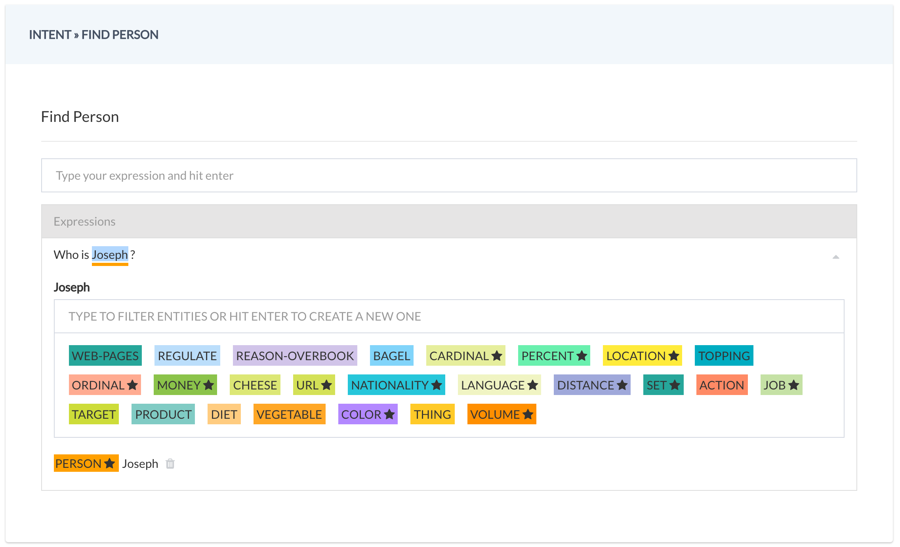

# Natural Language Processing

Natural langauage proessing is the most important part of your AI bot development process. Once you have created the bot using the following command:

```
recime-cli create hello-world
```

Go to `console.recime.io` and and click on the `Training` tab to create your first intent.




Set the entities for a given expression by right clicking on the expression after you have created.


Next, save the `recime-nlp-provider` to your project:

```
npm install --save recime-nlp-provider
```

Make a text request to it and it will return you the entites you have defined for an expression:

```javascript
import Ext from 'recime-bot-extension';
import responder from "recime-message-responder";

const __ = Ext.default;

exports.handler = (args, done)=>{
     nlp.textRequest(this.args.text).then((result)=>{
        if (result.entities.search_query 
        && result.entities.search_query[0].confidence > 0.8){
            // TODO:// meaningful code.
            done(__.text(`Hey~ ${result.entities.search_query[0].value}`));
        }
        else {
            done(__.text("Sorry I didnt understand."));
        }
    }, (err)=>{
        done(__.text(err.message));
    });
};
```
