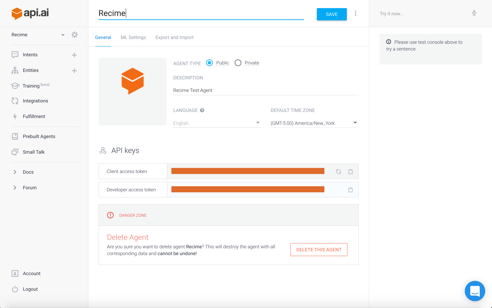
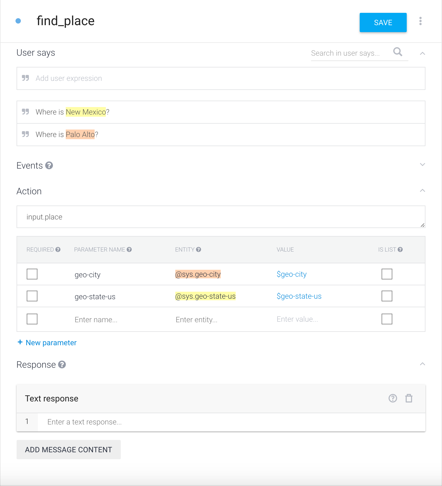

# Natural Language Understanding with Recime

Bring the natural language provider of choice with Recime as `npm` package. We have tested and recommend the following Natural Language providers:

  * [api.ai](https://api.ai) [Recommended]
  * [wit.ai](https://github.com/wit-ai/node-wit)
  * [IBM Watson](https://www.npmjs.com/package/watson-developer-cloud)

## Configuring `api.ai` with Recime

[api.ai](https://api.ai/) is a natural language understanding platform that makes it easy for developers \(and non-developers\) to design and integrate intelligent and sophisticated conversational user interfaces into mobile apps, web applications, devices, and bots.


In order to enable natural language processing using API.AI in Recime. Go to your `api.ai` console and copy the client access token:


  


For more information on how to obtain access token, please checkout the API.AI documentation here:

[https://docs.api.ai/docs/key-concepts](https://docs.api.ai/docs/key-concepts)

Go to your bot folder and install the `apiai` module:

```
npm install --save apiai

```

Set the client access token (copied earlier) as a config var:


```
recime-cli config set APIAI_KEY=PASTE_YOUR_ACCESS_TOKEN_HERE

```

Once everything is set, you can extract entities from a given `text` input in the following way:

```
import {APIAI} from 'apiai';

export class Bot {
  private args: any;
  private apiai:any;

  constructor(args: object){
       this.args = args;
       this.apiai = new APIAI(process.env.APIAI_KEY);
  }

  extract(): Promise<object>{
      let text = this.args.text;

      return new Promise((resolve, reject)=>{
            let options = {
                  sessionId : this.args.sender
            };

            let request = this.apiai.textRequest(text, options);

            request.on("response", (response)=>{
                  let result = response.result;
                  // TODO://
            });

           request.on('error', (err)=>{
              reject(err)
           });

           request.end();
      });
    }
}

```

`api.ai` makes it really easy to define your entities and intents using their interactive console. As for example, we have defined the following intent for extracting city for a given user expression.



