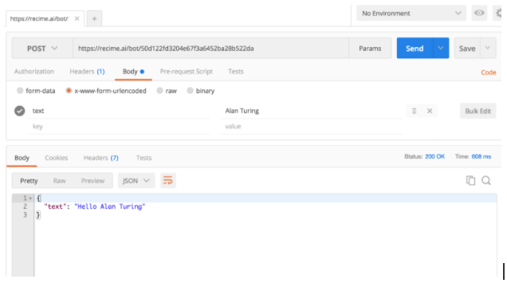

# POSTMAN

POSTMAN is a tool that allows you to test URI based APIs in a graphical user interface. Download Postman (or install the Chome extension) here: [https://www.getpostman.com](https://www.getpostman.com/)

Once you have Postman installed, open it up and put in the URI of your bot in the POST toolbar. The URI is what was returned by the compiler in earlier examples and looks like `https://bot.recime.io/UID/v1`

Before you execute, click on the Params button to add the parameter \(Alan Turing\). Click on the x-www-form-urlencoded option and addtextas the key and “Alan Turing” as the value. Then click on the Send button to send the request to the bot. The result should look like this:

