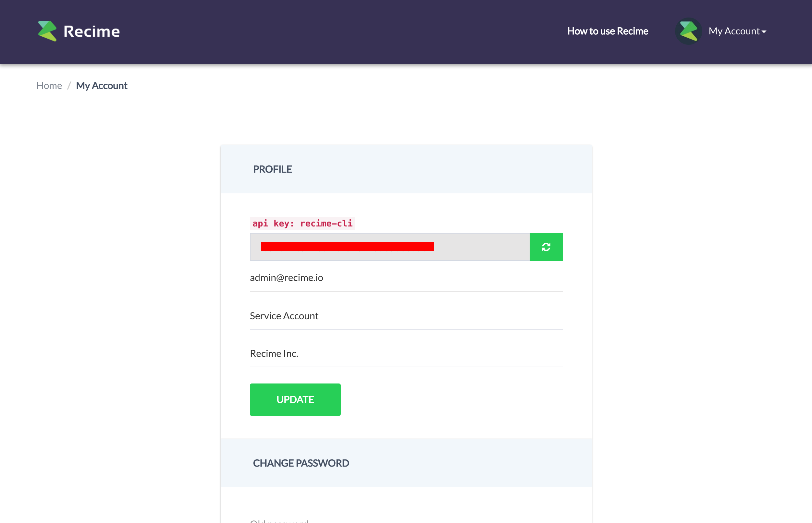

# Preparation

Once you have created the `Recime` account, the next step is to setup your CLI for development. Go to [console.recime.io/my_account](https://console.recime.io/my_account) and copy the API Key to your clipboard.




From your terminal type the following command `recime-cli login`. Once verified, you will see the following confirmation:


```
~ recime-cli login
Paste your api key from "console.recime.io/my_account":
2880e1f07a2149509661d1ad19408d5b
| 

Logged in as: josh@recime.io

For any questions and feedback, please reach us at hello@recime.io.

~ 

```

You can disable the console anytime by refreshing the token from the developer console.
