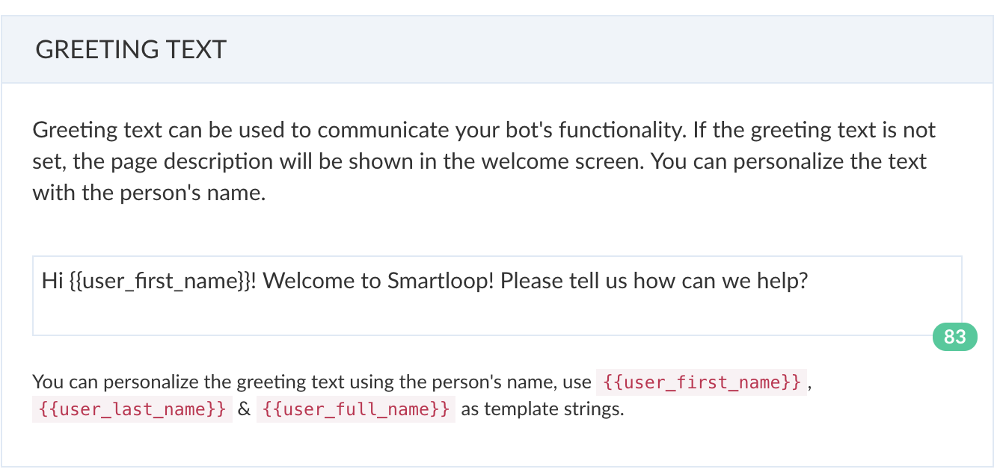
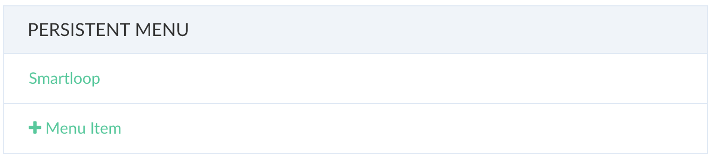
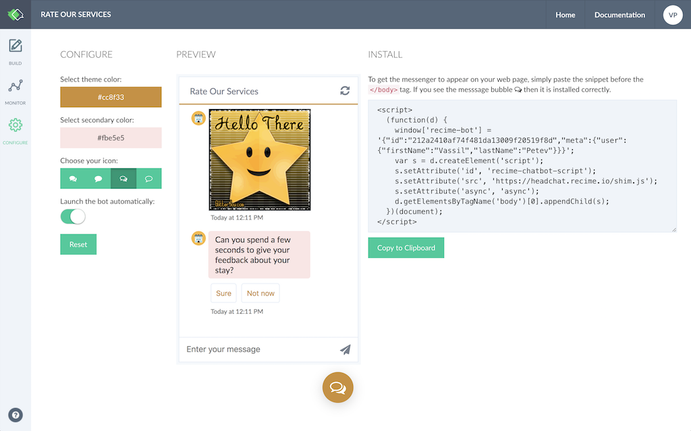
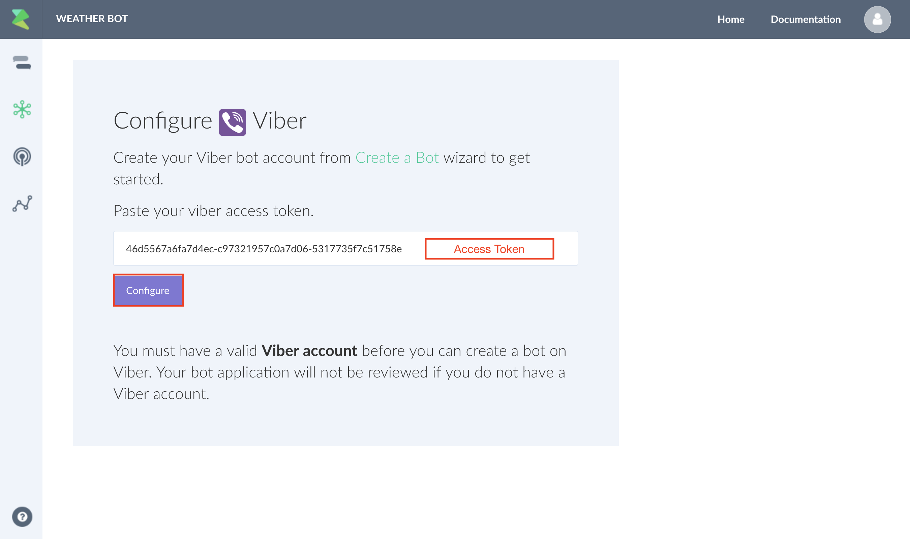

# Publishing a Bot

Different channels have different capabilities and publishing a bot to each one of them is native to the specific platform.


Below is a table showing differnt types of repsonse supported by each platform:

| Platform | Text | Image | Card | Carousel | Buttons | Quick Replies |
| -- | -- | -- | -- | -- | -- | -- |
| Facebook | Y | Y | Y | Generic Template | Y | Y |
| Website | Y | Y | Y | Y | Y | Y |
| Viber | Y | Y | Y | Y | Keyboard Button | -- |
| WeChat | Y | Y | -- | Article | -- | -- |

If you are using `Microsoft Bot Framwork` and Skype, it is translated in the following way:

| Platform | Text | Image | Card | Carousel | Buttons | Quick Replies |
| -- | -- | -- | -- | -- | -- | -- |
| Skype | Y | Y | Y | Y | Y | Hero Card with Buttons |

## Facebook

### Connect / Disconnect 

Connect your bot to a Facebook page using the Connect / Disconnect capability. If you are not already logged in using Facebook, it will take you through the OAuth flow for the required permissions.


### Update Greeting Text on Welcome Screen

Greeting text is shown on the welcome screen. You can update the gretting and include {{user_first_name}}, {{user_last_name}} and {{user_full_name}} to make it more personalized.



### Configure Persistent Menu

The persistent menu allows you to have an always-on user interface element inside Messenger conversations. This is an easy way to help people discover and access the core functionality of your Messenger bot at any point in the conversation.

You can link a block to the persistent menu using by clicking on "+ Menu Item" as shown below:




## Website

Website bot helps you replace your live agent with an automated one. Website bot gives you a similar experience to that of a live chat. However, the conversation happens with an automated agent instead of a human. This helps minimize the cost while being very effective and over time can bring in more leads to your website and improve the quality of service.

Click on the publish icon, configure the look and feel of your bot as shown below and then follow the instructions to copy and paste it to your website:




### Customization

You can customize the look and feel by modifying the following properties:

| Configuration | Value|
| -- | -- |
| Theme Color | This is the overall theme of your bot. This includes icon, text and bar color |
| Secondary Color | This is the color of the text bubble. |
| Icon| This specifies the icon that is shown in the start button |
| Launch the bot automatically | This specifies the initial state of the bot, if set to "open", it will start the bot automatically after the page is loaded successfully.|

### Sending Notification to the Bot (Advanced)

It is possible to send a notification to the bot for a user action  that can initiate the bot and take the user to a specific flow:

Let's say you have a `demo` block in your bot and on the website if someone clicks on "Request a Demo" button, it will trigger the demo flow:

```html 
<button id="request-a-demo">Requst a Demo</button>
```

In addition to the script above, copy and paste the following script before the `<body/>` tag:

```javascript
<script>
  (function(d) {
    d.addEventListener('DOMContentLoaded', function() {
      d.getElementById('request-a-demo').addEventListener('click', function() {
        headchat.open('demo');
      });
    });
  })(document);
</script>
```

This will open the website bot and take the user to the demo flow when a user clicks on "Request a Demo" button.


## Viber 

If you do not have a public account create a [Viber Public Account](https://www.viber.com/business/#public-accounts). Public account is subject to approval. It is possible to create a [bot account](https://partners.viber.com/account/create-bot-account). Once you have either bot / public account token. Click on the publish icon, copy and paste the token



Press "Configure" to set up the webhook.

## WeChat

WeChat is the #1 messaging service in China. It is used by over 700 million users and it is the most important channel in the Chinese market. 

In order to configure WeChat, you will need an [official account](http://open.wechat.com/cgi-bin/newreadtemplate?t=overseas_open/section_detail&show=office). You can also get a [Sandbox](https://mp.weixin.qq.com/debug/cgi-bin/sandbox?t=sandbox/login) to test your bot.

Once your WeChat account is verified, do the following to connect to your bot:

* Go to [WeChat dashboard](https://mp.weixin.qq.com/) and under "Basic Configuration | 基本配置", copy the IP `52.79.59.62` to the whitelist section.
* Go to "console->bot->publish", paste the App ID and App Secret from WeChat dashboard and create a token that you will use to verify the integration.


* Press "Update Configuration".

* In the WeChat dashboard, click on "Modify Configuration | 修改配置" and under "Basic Configuration", paste the Webhook URL from publish page.

* Save the configuration and enable the integration.
