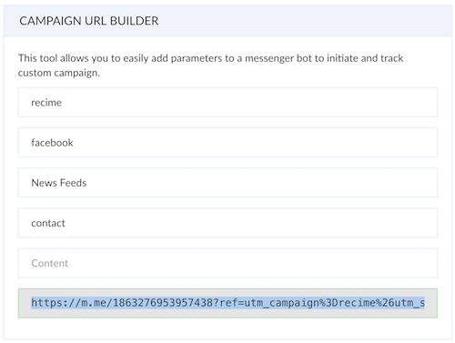
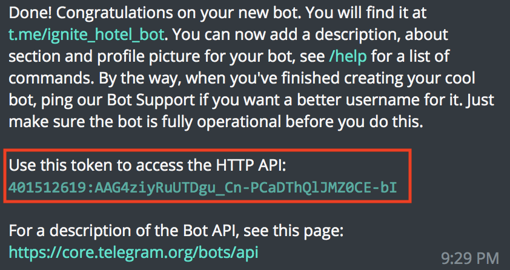
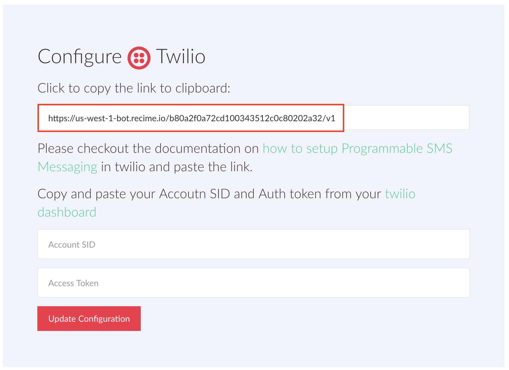
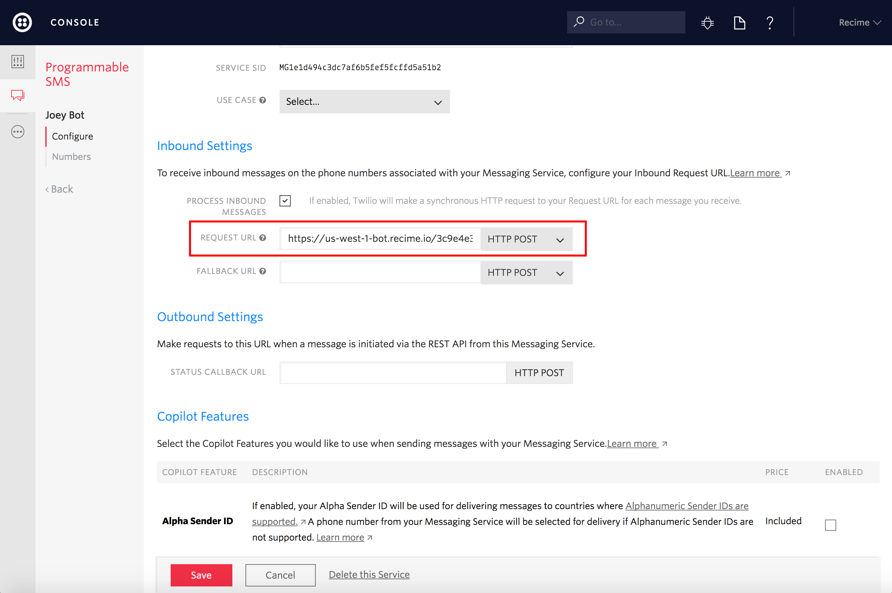
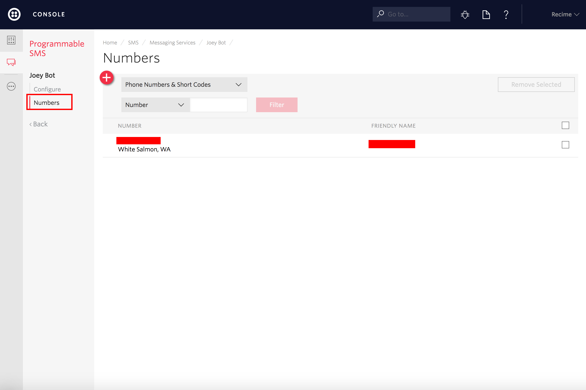

Publishing a Bot
================

Different channels have different capabilities and publishing a bot to
each one of them is native to the specific platform.

Below is a table showing differnt types of repsonse supported by each
platform:

+-----------+------+-------+------+------------------+-----------------+---------------+
| Platform  | Text | Image | Card | Carousel         | Buttons         | Quick Replies |
+===========+======+=======+======+==================+=================+===============+
| Facebook  | Y    | Y     | Y    | Generic Template | Y               | Y             |
+-----------+------+-------+------+------------------+-----------------+---------------+
| Website   | Y    | Y     | Y    | Y                | Y               | Y             |
+-----------+------+-------+------+------------------+-----------------+---------------+
| Viber     | Y    | Y     | Y    | Y                | Keyboard Button | --            |
+-----------+------+-------+------+------------------+-----------------+---------------+
| Telergram | Y    | Y     | --   | --               | Y               | Y             |
+-----------+------+-------+------+------------------+-----------------+---------------+
| WeChat    | Y    | Y     | --   | Article          | --              | --            |
+-----------+------+-------+------+------------------+-----------------+---------------+
| Twilio    | Y    | --    | --   | --               | --              | --            |
+-----------+------+-------+------+------------------+-----------------+---------------+

If you are using ``Microsoft Bot Framwork`` and Skype, it is translated
in the following way:

+----------+------+-------+------+----------+---------+------------------------+
| Platform | Text | Image | Card | Carousel | Buttons | Quick Replies          |
+==========+======+=======+======+==========+=========+========================+
| Skype    | Y    | Y     | Y    | Y        | Y       | Hero Card with Buttons |
+----------+------+-------+------+----------+---------+------------------------+

Facebook
--------

.. connect--disconnect:

Connect / Disconnect
~~~~~~~~~~~~~~~~~~~~

Connect your bot to a Facebook page using the Connect / Disconnect
capability. If you are not already logged in using Facebook, it will
take you through the OAuth flow for the required permissions.

|image0|

Update Greeting Text on Welcome Screen
~~~~~~~~~~~~~~~~~~~~~~~~~~~~~~~~~~~~~~

Greeting text is shown on the welcome screen. You can update the
gretting and include {{user_first_name}}, {{user_last_name}} and
{{user_full_name}} to make it more personalized.

|image1|

Configure Persistent Menu
~~~~~~~~~~~~~~~~~~~~~~~~~

The persistent menu allows you to have an always-on user interface
element inside Messenger conversations. This is an easy way to help
people discover and access the core functionality of your Messenger bot
at any point in the conversation.

You can link a block to the persistent menu using by clicking on "+ Menu
Item" as shown below:

|image2|

Campaign URL Builder
~~~~~~~~~~~~~~~~~~~~

You can easily use campaign parameters in ``https://m.me`` link and
trigger a specific block. The following table gives an overview of
various campaign parameters that you take advantage of.

+-----------------------------------+-----------------------------------+
| Type                              | Description                       |
+===================================+===================================+
| Campaign Name ``utm_campaign``    | ``Required`` Use utm_campaign to  |
|                                   | identify a specific promotion.    |
+-----------------------------------+-----------------------------------+
| Campaign Source ``utm_source``    | Use utm_source to identify the    |
|                                   | link source. Example: facebook    |
+-----------------------------------+-----------------------------------+
| Campaign Medium ``utm_medium``    | Use utm_medium to identify a      |
|                                   | medium such as ``feed``.          |
+-----------------------------------+-----------------------------------+
| Campaign Term ``utm_term``        | Use utm_term to trigger a block.  |
|                                   | Example: start                    |
+-----------------------------------+-----------------------------------+
| Campaign Content ``utm_content``  | Used for A/B testing and          |
|                                   | content-targeted ads. Use         |
|                                   | utm_content to differentiate      |
|                                   | links.                            |
+-----------------------------------+-----------------------------------+

Use the campaign link builder form to generate a ``m.me`` link as shown
below:

|image3|

Website
-------

Website bot helps you replace your live agent with an automated agent.
Website bot gives you similar chat window that you generally see when
visiting a website but conversation happens with an intelligent agent
instead of a human. This can minimize the cost while being very
effective and over time can bring in more leads to your website.

Click on the publish icon, copy and paste the script before the
``<body/>`` tag.

|image4|

Basic Configuration
~~~~~~~~~~~~~~~~~~~

You can customize the look and feel as well as the profile by modifying
the following properties:

+-----------------------------------+-----------------------------------+
| Name                              | Value                             |
+===================================+===================================+
| title                             | Title of your website bot that is |
|                                   | shown in the nav bar              |
+-----------------------------------+-----------------------------------+
| primaryColor                      | Theme color of the website bot.   |
+-----------------------------------+-----------------------------------+
| meta                              | User data, in case of logged in   |
|                                   | user this can be set to track the |
|                                   | user                              |
+-----------------------------------+-----------------------------------+

Sending Notification to the Bot (Advanced)
~~~~~~~~~~~~~~~~~~~~~~~~~~~~~~~~~~~~~~~~~~

It is possible to send a notification to the bot for a user action that
can initiate the bot and take the user to a specific flow:

Let's say you have a ``demo`` block in your bot and on the website if
someone clicks on "Request a Demo" button, it will trigger the demo
flow:

.. code:: html

    <button id="request-a-demo">Requst a Demo</button>

In addition to the script above, copy and paste the following script
before the ``<body/>`` tag:

.. code:: javascript

    

This will open the website bot and take the user to the demo flow when a
user clicks on "Request a Demo" button.

Viber
-----

If you do not have a public account create a `Viber Public
Account <https://www.viber.com/business/#public-accounts>`__. Public
account is subject to approval. It is possible to create a `bot
account <https://partners.viber.com/account/create-bot-account>`__. Once
you have either bot / public account token. Click on the publish icon,
copy and paste the token

|image5|

Press "Configure" to set up the webhook.

Telegram
--------

Use the `Bot Father <https://telegram.me/botfather>`__ app to configure
your telegram bot. Once you have created the bot, it will give you an
access token as shown below:

|image6|

Click on the publish icon, copy and paste the token.

|image7|

Press "Configure" to set up the webhook.

WeChat
------

WeChat is the #1 messaging service in China. It is used by over 700
million users and it is the most important channel in the Chinese
market.

In order to configure WeChat, you will need an `official
account <http://open.wechat.com/cgi-bin/newreadtemplate?t=overseas_open/section_detail&show=office>`__.
You can also get a
`Sandbox <https://mp.weixin.qq.com/debug/cgi-bin/sandbox?t=sandbox/login>`__
to test your bot.

Once your WeChat account is verified, do the following to connect to
your bot:

-  Go to `WeChat dashboard <https://mp.weixin.qq.com/>`__ and under
   "Basic Configuration \| 基本配置", copy the IP ``52.79.59.62`` to the
   whitelist section.
-  Go to "console->bot->publish", paste the App ID and App Secret from
   WeChat dashboard and create a token that you will use to verify the
   integration.

|image8|

-  Press "Update Configuration".

-  In the WeChat dashboard, click on "Modify Configuration \| 修改配置"
   and under "Basic Configuration", paste the Webhook URL from publish
   page.

-  Save the configuration and enable the integration.

Twilio
------

Create a Messaging Service
~~~~~~~~~~~~~~~~~~~~~~~~~~

The first step is to create a new ``Programmable SMS Messaging``
Service. Go to Home->Dashboard in your Twilio console.

Select Programmable SMS under the Messaging section:

|image9|

Next, create a messaging service by clicking on the "Create a new
Messaging Service" button:

|image10|

Configure Webhook
~~~~~~~~~~~~~~~~~

Once the service is created. Copy the webhook link from the publish
dialog :

|image11|

Paste it in the inbound request URL textbox :

|image12|

Save the messaging service by clicking the Save button at the bottom of
the screen. Now, add a phone number for the newly added service by
clicking on the "Numbers" link in the menu:

|image13|

If you already have a number you'd like to use, choose that, otherwise
create a new one.

Once you got the number and linked it to the messaging service, copy and
paste your Account SID and Auth token from your `twilio
dashboard <https://www.twilio.com/console>`__:

|image14|

Click "Update Configuration".

.. |image0| image:: connect-facebook.png
.. |image1| image:: greeting-text.png
.. |image2| image:: persistent-menu.png

.. |image4| image:: website-bot.png
.. |image5| image:: viber-config.png

.. |image7| image:: configure-telegram.png
.. |image8| image:: wechat-configuration.png
.. |image9| image:: setup-twilio.png
.. |image10| image:: message-service.png

.. |image14| image:: configure-twilio.png

